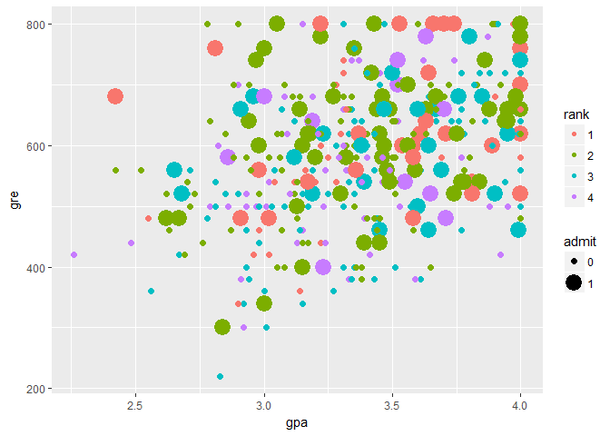

ExPanDaR: An Intro
================
Joachim Gassen
January 7, 2018

ExPanDaR Package Functions
--------------------------

You are visiting the gihub repository of the ExPanDaR (Exploare Panel Data with R) package. ExPanDaR is a small and extremely early stage package which will develop into the package facilitating the use of the ExPanD web app. ExPanD is a shiny based app designed to allow users with little or no statistical programming experience the opportunity to explore panel data. In addition, it will serve as a frontend to assess the robustness of empirical archival research work.

While the main purpose of ExPanD is to allow dynamic panel data exploration using the ExPanD web app, the auxilliary functions of the ExPanDaR package can also be used for rapid prototyping data analysis.

### Descriptive Statistics

For example, you can use them for preparing descriptive statistics:

``` r
t <- prepare_descriptive_table(mtcars)
t$kable_ret  %>%
  kable_styling("condensed", full_width = F, position = "center")
```

<table class="table table-condensed" style="width: auto !important; margin-left: auto; margin-right: auto;">
<caption>
Descriptive Statistics
</caption>
<thead>
<tr>
<th style="text-align:left;">
</th>
<th style="text-align:right;">
N
</th>
<th style="text-align:right;">
Mean
</th>
<th style="text-align:right;">
Std. dev.
</th>
<th style="text-align:right;">
Min.
</th>
<th style="text-align:right;">
25 %
</th>
<th style="text-align:right;">
Median
</th>
<th style="text-align:right;">
75 %
</th>
<th style="text-align:right;">
Max.
</th>
</tr>
</thead>
<tbody>
<tr>
<td style="text-align:left;">
mpg
</td>
<td style="text-align:right;">
32
</td>
<td style="text-align:right;">
20.091
</td>
<td style="text-align:right;">
6.027
</td>
<td style="text-align:right;">
10.400
</td>
<td style="text-align:right;">
15.425
</td>
<td style="text-align:right;">
19.200
</td>
<td style="text-align:right;">
22.80
</td>
<td style="text-align:right;">
33.900
</td>
</tr>
<tr>
<td style="text-align:left;">
cyl
</td>
<td style="text-align:right;">
32
</td>
<td style="text-align:right;">
6.188
</td>
<td style="text-align:right;">
1.786
</td>
<td style="text-align:right;">
4.000
</td>
<td style="text-align:right;">
4.000
</td>
<td style="text-align:right;">
6.000
</td>
<td style="text-align:right;">
8.00
</td>
<td style="text-align:right;">
8.000
</td>
</tr>
<tr>
<td style="text-align:left;">
disp
</td>
<td style="text-align:right;">
32
</td>
<td style="text-align:right;">
230.722
</td>
<td style="text-align:right;">
123.939
</td>
<td style="text-align:right;">
71.100
</td>
<td style="text-align:right;">
120.825
</td>
<td style="text-align:right;">
196.300
</td>
<td style="text-align:right;">
326.00
</td>
<td style="text-align:right;">
472.000
</td>
</tr>
<tr>
<td style="text-align:left;">
hp
</td>
<td style="text-align:right;">
32
</td>
<td style="text-align:right;">
146.688
</td>
<td style="text-align:right;">
68.563
</td>
<td style="text-align:right;">
52.000
</td>
<td style="text-align:right;">
96.500
</td>
<td style="text-align:right;">
123.000
</td>
<td style="text-align:right;">
180.00
</td>
<td style="text-align:right;">
335.000
</td>
</tr>
<tr>
<td style="text-align:left;">
drat
</td>
<td style="text-align:right;">
32
</td>
<td style="text-align:right;">
3.597
</td>
<td style="text-align:right;">
0.535
</td>
<td style="text-align:right;">
2.760
</td>
<td style="text-align:right;">
3.080
</td>
<td style="text-align:right;">
3.695
</td>
<td style="text-align:right;">
3.92
</td>
<td style="text-align:right;">
4.930
</td>
</tr>
<tr>
<td style="text-align:left;">
wt
</td>
<td style="text-align:right;">
32
</td>
<td style="text-align:right;">
3.217
</td>
<td style="text-align:right;">
0.978
</td>
<td style="text-align:right;">
1.513
</td>
<td style="text-align:right;">
2.581
</td>
<td style="text-align:right;">
3.325
</td>
<td style="text-align:right;">
3.61
</td>
<td style="text-align:right;">
5.424
</td>
</tr>
<tr>
<td style="text-align:left;">
qsec
</td>
<td style="text-align:right;">
32
</td>
<td style="text-align:right;">
17.849
</td>
<td style="text-align:right;">
1.787
</td>
<td style="text-align:right;">
14.500
</td>
<td style="text-align:right;">
16.892
</td>
<td style="text-align:right;">
17.710
</td>
<td style="text-align:right;">
18.90
</td>
<td style="text-align:right;">
22.900
</td>
</tr>
<tr>
<td style="text-align:left;">
vs
</td>
<td style="text-align:right;">
32
</td>
<td style="text-align:right;">
0.438
</td>
<td style="text-align:right;">
0.504
</td>
<td style="text-align:right;">
0.000
</td>
<td style="text-align:right;">
0.000
</td>
<td style="text-align:right;">
0.000
</td>
<td style="text-align:right;">
1.00
</td>
<td style="text-align:right;">
1.000
</td>
</tr>
<tr>
<td style="text-align:left;">
am
</td>
<td style="text-align:right;">
32
</td>
<td style="text-align:right;">
0.406
</td>
<td style="text-align:right;">
0.499
</td>
<td style="text-align:right;">
0.000
</td>
<td style="text-align:right;">
0.000
</td>
<td style="text-align:right;">
0.000
</td>
<td style="text-align:right;">
1.00
</td>
<td style="text-align:right;">
1.000
</td>
</tr>
<tr>
<td style="text-align:left;">
gear
</td>
<td style="text-align:right;">
32
</td>
<td style="text-align:right;">
3.688
</td>
<td style="text-align:right;">
0.738
</td>
<td style="text-align:right;">
3.000
</td>
<td style="text-align:right;">
3.000
</td>
<td style="text-align:right;">
4.000
</td>
<td style="text-align:right;">
4.00
</td>
<td style="text-align:right;">
5.000
</td>
</tr>
<tr>
<td style="text-align:left;">
carb
</td>
<td style="text-align:right;">
32
</td>
<td style="text-align:right;">
2.812
</td>
<td style="text-align:right;">
1.615
</td>
<td style="text-align:right;">
1.000
</td>
<td style="text-align:right;">
2.000
</td>
<td style="text-align:right;">
2.000
</td>
<td style="text-align:right;">
4.00
</td>
<td style="text-align:right;">
8.000
</td>
</tr>
</tbody>
</table>
Those who are working with me know that I am a big fan of correlation tables.

``` r
t<- prepare_correlation_table(mtcars, bold = 0.01, format="html")
t$kable_ret %>%
  kable_styling("condensed", full_width = F, position = "center")
```

<table class="table table-condensed" style="width: auto !important; margin-left: auto; margin-right: auto;">
<thead>
<tr>
<th style="text-align:left;">
</th>
<th style="text-align:right;">
A
</th>
<th style="text-align:right;">
B
</th>
<th style="text-align:right;">
C
</th>
<th style="text-align:right;">
D
</th>
<th style="text-align:right;">
E
</th>
<th style="text-align:right;">
F
</th>
<th style="text-align:right;">
G
</th>
<th style="text-align:right;">
H
</th>
<th style="text-align:right;">
I
</th>
<th style="text-align:right;">
J
</th>
<th style="text-align:right;">
K
</th>
</tr>
</thead>
<tbody>
<tr>
<td style="text-align:left;">
A: mpg
</td>
<td style="text-align:right;">
</td>
<td style="text-align:right;">
<span style=" font-weight: bold;">-0.85</span>
</td>
<td style="text-align:right;">
<span style=" font-weight: bold;">-0.85</span>
</td>
<td style="text-align:right;">
<span style=" font-weight: bold;">-0.78</span>
</td>
<td style="text-align:right;">
<span style=" font-weight: bold;">0.68</span>
</td>
<td style="text-align:right;">
<span style=" font-weight: bold;">-0.87</span>
</td>
<td style="text-align:right;">
<span style="">0.42</span>
</td>
<td style="text-align:right;">
<span style=" font-weight: bold;">0.66</span>
</td>
<td style="text-align:right;">
<span style=" font-weight: bold;">0.60</span>
</td>
<td style="text-align:right;">
<span style=" font-weight: bold;">0.48</span>
</td>
<td style="text-align:right;">
<span style=" font-weight: bold;">-0.55</span>
</td>
</tr>
<tr>
<td style="text-align:left;">
B: cyl
</td>
<td style="text-align:right;">
<span style=" font-weight: bold;">-0.91</span>
</td>
<td style="text-align:right;">
</td>
<td style="text-align:right;">
<span style=" font-weight: bold;">0.90</span>
</td>
<td style="text-align:right;">
<span style=" font-weight: bold;">0.83</span>
</td>
<td style="text-align:right;">
<span style=" font-weight: bold;">-0.70</span>
</td>
<td style="text-align:right;">
<span style=" font-weight: bold;">0.78</span>
</td>
<td style="text-align:right;">
<span style=" font-weight: bold;">-0.59</span>
</td>
<td style="text-align:right;">
<span style=" font-weight: bold;">-0.81</span>
</td>
<td style="text-align:right;">
<span style=" font-weight: bold;">-0.52</span>
</td>
<td style="text-align:right;">
<span style=" font-weight: bold;">-0.49</span>
</td>
<td style="text-align:right;">
<span style=" font-weight: bold;">0.53</span>
</td>
</tr>
<tr>
<td style="text-align:left;">
C: disp
</td>
<td style="text-align:right;">
<span style=" font-weight: bold;">-0.91</span>
</td>
<td style="text-align:right;">
<span style=" font-weight: bold;">0.93</span>
</td>
<td style="text-align:right;">
</td>
<td style="text-align:right;">
<span style=" font-weight: bold;">0.79</span>
</td>
<td style="text-align:right;">
<span style=" font-weight: bold;">-0.71</span>
</td>
<td style="text-align:right;">
<span style=" font-weight: bold;">0.89</span>
</td>
<td style="text-align:right;">
<span style="">-0.43</span>
</td>
<td style="text-align:right;">
<span style=" font-weight: bold;">-0.71</span>
</td>
<td style="text-align:right;">
<span style=" font-weight: bold;">-0.59</span>
</td>
<td style="text-align:right;">
<span style=" font-weight: bold;">-0.56</span>
</td>
<td style="text-align:right;">
<span style="">0.39</span>
</td>
</tr>
<tr>
<td style="text-align:left;">
D: hp
</td>
<td style="text-align:right;">
<span style=" font-weight: bold;">-0.89</span>
</td>
<td style="text-align:right;">
<span style=" font-weight: bold;">0.90</span>
</td>
<td style="text-align:right;">
<span style=" font-weight: bold;">0.85</span>
</td>
<td style="text-align:right;">
</td>
<td style="text-align:right;">
<span style=" font-weight: bold;">-0.45</span>
</td>
<td style="text-align:right;">
<span style=" font-weight: bold;">0.66</span>
</td>
<td style="text-align:right;">
<span style=" font-weight: bold;">-0.71</span>
</td>
<td style="text-align:right;">
<span style=" font-weight: bold;">-0.72</span>
</td>
<td style="text-align:right;">
<span style="">-0.24</span>
</td>
<td style="text-align:right;">
<span style="">-0.13</span>
</td>
<td style="text-align:right;">
<span style=" font-weight: bold;">0.75</span>
</td>
</tr>
<tr>
<td style="text-align:left;">
E: drat
</td>
<td style="text-align:right;">
<span style=" font-weight: bold;">0.65</span>
</td>
<td style="text-align:right;">
<span style=" font-weight: bold;">-0.68</span>
</td>
<td style="text-align:right;">
<span style=" font-weight: bold;">-0.68</span>
</td>
<td style="text-align:right;">
<span style=" font-weight: bold;">-0.52</span>
</td>
<td style="text-align:right;">
</td>
<td style="text-align:right;">
<span style=" font-weight: bold;">-0.71</span>
</td>
<td style="text-align:right;">
<span style="">0.09</span>
</td>
<td style="text-align:right;">
<span style="">0.44</span>
</td>
<td style="text-align:right;">
<span style=" font-weight: bold;">0.71</span>
</td>
<td style="text-align:right;">
<span style=" font-weight: bold;">0.70</span>
</td>
<td style="text-align:right;">
<span style="">-0.09</span>
</td>
</tr>
<tr>
<td style="text-align:left;">
F: wt
</td>
<td style="text-align:right;">
<span style=" font-weight: bold;">-0.89</span>
</td>
<td style="text-align:right;">
<span style=" font-weight: bold;">0.86</span>
</td>
<td style="text-align:right;">
<span style=" font-weight: bold;">0.90</span>
</td>
<td style="text-align:right;">
<span style=" font-weight: bold;">0.77</span>
</td>
<td style="text-align:right;">
<span style=" font-weight: bold;">-0.75</span>
</td>
<td style="text-align:right;">
</td>
<td style="text-align:right;">
<span style="">-0.17</span>
</td>
<td style="text-align:right;">
<span style=" font-weight: bold;">-0.55</span>
</td>
<td style="text-align:right;">
<span style=" font-weight: bold;">-0.69</span>
</td>
<td style="text-align:right;">
<span style=" font-weight: bold;">-0.58</span>
</td>
<td style="text-align:right;">
<span style="">0.43</span>
</td>
</tr>
<tr>
<td style="text-align:left;">
G: qsec
</td>
<td style="text-align:right;">
<span style=" font-weight: bold;">0.47</span>
</td>
<td style="text-align:right;">
<span style=" font-weight: bold;">-0.57</span>
</td>
<td style="text-align:right;">
<span style=" font-weight: bold;">-0.46</span>
</td>
<td style="text-align:right;">
<span style=" font-weight: bold;">-0.67</span>
</td>
<td style="text-align:right;">
<span style="">0.09</span>
</td>
<td style="text-align:right;">
<span style="">-0.23</span>
</td>
<td style="text-align:right;">
</td>
<td style="text-align:right;">
<span style=" font-weight: bold;">0.74</span>
</td>
<td style="text-align:right;">
<span style="">-0.23</span>
</td>
<td style="text-align:right;">
<span style="">-0.21</span>
</td>
<td style="text-align:right;">
<span style=" font-weight: bold;">-0.66</span>
</td>
</tr>
<tr>
<td style="text-align:left;">
H: vs
</td>
<td style="text-align:right;">
<span style=" font-weight: bold;">0.71</span>
</td>
<td style="text-align:right;">
<span style=" font-weight: bold;">-0.81</span>
</td>
<td style="text-align:right;">
<span style=" font-weight: bold;">-0.72</span>
</td>
<td style="text-align:right;">
<span style=" font-weight: bold;">-0.75</span>
</td>
<td style="text-align:right;">
<span style="">0.45</span>
</td>
<td style="text-align:right;">
<span style=" font-weight: bold;">-0.59</span>
</td>
<td style="text-align:right;">
<span style=" font-weight: bold;">0.79</span>
</td>
<td style="text-align:right;">
</td>
<td style="text-align:right;">
<span style="">0.17</span>
</td>
<td style="text-align:right;">
<span style="">0.21</span>
</td>
<td style="text-align:right;">
<span style=" font-weight: bold;">-0.57</span>
</td>
</tr>
<tr>
<td style="text-align:left;">
I: am
</td>
<td style="text-align:right;">
<span style=" font-weight: bold;">0.56</span>
</td>
<td style="text-align:right;">
<span style=" font-weight: bold;">-0.52</span>
</td>
<td style="text-align:right;">
<span style=" font-weight: bold;">-0.62</span>
</td>
<td style="text-align:right;">
<span style="">-0.36</span>
</td>
<td style="text-align:right;">
<span style=" font-weight: bold;">0.69</span>
</td>
<td style="text-align:right;">
<span style=" font-weight: bold;">-0.74</span>
</td>
<td style="text-align:right;">
<span style="">-0.20</span>
</td>
<td style="text-align:right;">
<span style="">0.17</span>
</td>
<td style="text-align:right;">
</td>
<td style="text-align:right;">
<span style=" font-weight: bold;">0.79</span>
</td>
<td style="text-align:right;">
<span style="">0.06</span>
</td>
</tr>
<tr>
<td style="text-align:left;">
J: gear
</td>
<td style="text-align:right;">
<span style=" font-weight: bold;">0.54</span>
</td>
<td style="text-align:right;">
<span style=" font-weight: bold;">-0.56</span>
</td>
<td style="text-align:right;">
<span style=" font-weight: bold;">-0.59</span>
</td>
<td style="text-align:right;">
<span style="">-0.33</span>
</td>
<td style="text-align:right;">
<span style=" font-weight: bold;">0.74</span>
</td>
<td style="text-align:right;">
<span style=" font-weight: bold;">-0.68</span>
</td>
<td style="text-align:right;">
<span style="">-0.15</span>
</td>
<td style="text-align:right;">
<span style="">0.28</span>
</td>
<td style="text-align:right;">
<span style=" font-weight: bold;">0.81</span>
</td>
<td style="text-align:right;">
</td>
<td style="text-align:right;">
<span style="">0.27</span>
</td>
</tr>
<tr>
<td style="text-align:left;">
K: carb
</td>
<td style="text-align:right;">
<span style=" font-weight: bold;">-0.66</span>
</td>
<td style="text-align:right;">
<span style=" font-weight: bold;">0.58</span>
</td>
<td style="text-align:right;">
<span style=" font-weight: bold;">0.54</span>
</td>
<td style="text-align:right;">
<span style=" font-weight: bold;">0.73</span>
</td>
<td style="text-align:right;">
<span style="">-0.13</span>
</td>
<td style="text-align:right;">
<span style=" font-weight: bold;">0.50</span>
</td>
<td style="text-align:right;">
<span style=" font-weight: bold;">-0.66</span>
</td>
<td style="text-align:right;">
<span style=" font-weight: bold;">-0.63</span>
</td>
<td style="text-align:right;">
<span style="">-0.06</span>
</td>
<td style="text-align:right;">
<span style="">0.11</span>
</td>
<td style="text-align:right;">
</td>
</tr>
</tbody>
<tfoot>
<tr>
<td style="padding: 0; border: 0;" colspan="100%">
<sup></sup> This table reports Pearson correlations above and Spearman correlations below the diagonal. Number of observations: 32. Correlations with significance levels below 1% appear in bold print.
</td>
</tr>
</tfoot>
</table>
In fact, I like them so much that I sometimes use a graphic variant based on the corrplot package. See for yourself.

``` r
prepare_correlation_graph(mtcars)
```


One thing that comes very handy when dealing with outliers is a quick way to observe extreme values.

``` r
t <- prepare_ext_obs_table(data.frame(name = rownames(mtcars), hp = mtcars$hp), row.names = T)
t$kable_ret %>%
  kable_styling("condensed", full_width = F, position = "center")
```

<table class="table table-condensed" style="width: auto !important; margin-left: auto; margin-right: auto;">
<thead>
<tr>
<th style="text-align:left;">
</th>
<th style="text-align:left;">
name
</th>
<th style="text-align:right;">
hp
</th>
</tr>
</thead>
<tbody>
<tr>
<td style="text-align:left;">
31
</td>
<td style="text-align:left;">
Maserati Bora
</td>
<td style="text-align:right;">
335
</td>
</tr>
<tr>
<td style="text-align:left;">
29
</td>
<td style="text-align:left;">
Ford Pantera L
</td>
<td style="text-align:right;">
264
</td>
</tr>
<tr>
<td style="text-align:left;">
7
</td>
<td style="text-align:left;">
Duster 360
</td>
<td style="text-align:right;">
245
</td>
</tr>
<tr>
<td style="text-align:left;">
24
</td>
<td style="text-align:left;">
Camaro Z28
</td>
<td style="text-align:right;">
245
</td>
</tr>
<tr>
<td style="text-align:left;">
17
</td>
<td style="text-align:left;">
Chrysler Imperial
</td>
<td style="text-align:right;">
230
</td>
</tr>
<tr>
<td style="text-align:left;">
</td>
<td style="text-align:left;">
...
</td>
<td style="text-align:right;">
...
</td>
</tr>
<tr>
<td style="text-align:left;">
18
</td>
<td style="text-align:left;">
Fiat 128
</td>
<td style="text-align:right;">
66
</td>
</tr>
<tr>
<td style="text-align:left;">
26
</td>
<td style="text-align:left;">
Fiat X1-9
</td>
<td style="text-align:right;">
66
</td>
</tr>
<tr>
<td style="text-align:left;">
20
</td>
<td style="text-align:left;">
Toyota Corolla
</td>
<td style="text-align:right;">
65
</td>
</tr>
<tr>
<td style="text-align:left;">
8
</td>
<td style="text-align:left;">
Merc 240D
</td>
<td style="text-align:right;">
62
</td>
</tr>
<tr>
<td style="text-align:left;">
19
</td>
<td style="text-align:left;">
Honda Civic
</td>
<td style="text-align:right;">
52
</td>
</tr>
</tbody>
</table>
### Visuals

Additional visuals are available for exploring time trends. For comparing variables...

``` r
df <- data.frame(year =floor(time(EuStockMarkets)), EuStockMarkets)
graph <- prepare_trend_graph(df, "year")
```

    ## Warning: package 'bindrcpp' was built under R version 3.3.3

``` r
graph$plot
```


... and for eyeballing the distributional properties of a single variable over time.

``` r
df <- data.frame(year = floor(time(EuStockMarkets)), DAX = EuStockMarkets[,"DAX"])
graph <- prepare_quantile_trend_graph(df, "year", c(0.05, 0.25, 0.5, 0.75, 0.95))
graph$plot
```


And, of course, the mother of all plots, the scatter plot.

``` r
df <- data.frame(year = as.numeric(time(EuStockMarkets)), EuStockMarkets[, c("DAX", "FTSE")])
prepare_scatter_plot(df, x="DAX", y="FTSE", color="year")
```


### Regression Tables

And, if you happen to be a fan of starred numbers, you can also quickly produce regression tables. Both, by mixing different models...

``` r
df <- data.frame(year = as.factor(floor(time(EuStockMarkets))), EuStockMarkets)
dvs <- list("DAX", "SMI", "CAC", "FTSE")
idvs <- list(c("SMI", "CAC", "FTSE"), 
             c("DAX", "CAC", "FTSE"), 
             c("SMI", "DAX", "FTSE"), 
             c("SMI", "CAC", "DAX"))
feffects <- list("year", "year", "year", "year")
clusters <- list("year", "year", "year", "year")
t <- prepare_regression_table(df, dvs, idvs, feffects, clusters)
htmltools::HTML(t$table)
```

<!--html_preserve-->
<table style="text-align:center">
<tr>
<td colspan="5" style="border-bottom: 1px solid black">
</td>
</tr>
<tr>
<td style="text-align:left">
</td>
<td colspan="4">
<em>Dependent variable:</em>
</td>
</tr>
<tr>
<td>
</td>
<td colspan="4" style="border-bottom: 1px solid black">
</td>
</tr>
<tr>
<td style="text-align:left">
</td>
<td>
DAX
</td>
<td>
SMI
</td>
<td>
CAC
</td>
<td>
FTSE
</td>
</tr>
<tr>
<td style="text-align:left">
</td>
<td>
(1)
</td>
<td>
(2)
</td>
<td>
(3)
</td>
<td>
(4)
</td>
</tr>
<tr>
<td colspan="5" style="border-bottom: 1px solid black">
</td>
</tr>
<tr>
<td style="text-align:left">
SMI
</td>
<td>
0.447<sup>\*\*\*</sup>
</td>
<td>
</td>
<td>
-0.095
</td>
<td>
0.566<sup>\*\*\*</sup>
</td>
</tr>
<tr>
<td style="text-align:left">
</td>
<td>
(0.046)
</td>
<td>
</td>
<td>
(0.088)
</td>
<td>
(0.107)
</td>
</tr>
<tr>
<td style="text-align:left">
</td>
<td>
</td>
<td>
</td>
<td>
</td>
<td>
</td>
</tr>
<tr>
<td style="text-align:left">
DAX
</td>
<td>
</td>
<td>
0.864<sup>\*\*\*</sup>
</td>
<td>
0.664<sup>\*\*\*</sup>
</td>
<td>
-0.188
</td>
</tr>
<tr>
<td style="text-align:left">
</td>
<td>
</td>
<td>
(0.169)
</td>
<td>
(0.141)
</td>
<td>
(0.181)
</td>
</tr>
<tr>
<td style="text-align:left">
</td>
<td>
</td>
<td>
</td>
<td>
</td>
<td>
</td>
</tr>
<tr>
<td style="text-align:left">
CAC
</td>
<td>
0.735<sup>\*\*\*</sup>
</td>
<td>
-0.204
</td>
<td>
</td>
<td>
0.188<sup>\*</sup>
</td>
</tr>
<tr>
<td style="text-align:left">
</td>
<td>
(0.111)
</td>
<td>
(0.219)
</td>
<td>
</td>
<td>
(0.102)
</td>
</tr>
<tr>
<td style="text-align:left">
</td>
<td>
</td>
<td>
</td>
<td>
</td>
<td>
</td>
</tr>
<tr>
<td style="text-align:left">
FTSE
</td>
<td>
-0.124
</td>
<td>
0.722<sup>\*\*\*</sup>
</td>
<td>
0.112
</td>
<td>
</td>
</tr>
<tr>
<td style="text-align:left">
</td>
<td>
(0.125)
</td>
<td>
(0.060)
</td>
<td>
(0.075)
</td>
<td>
</td>
</tr>
<tr>
<td style="text-align:left">
</td>
<td>
</td>
<td>
</td>
<td>
</td>
<td>
</td>
</tr>
<tr>
<td colspan="5" style="border-bottom: 1px solid black">
</td>
</tr>
<tr>
<td style="text-align:left">
Fixed effects
</td>
<td>
year
</td>
<td>
year
</td>
<td>
year
</td>
<td>
year
</td>
</tr>
<tr>
<td style="text-align:left">
Std. errors clustered
</td>
<td>
year
</td>
<td>
year
</td>
<td>
year
</td>
<td>
year
</td>
</tr>
<tr>
<td style="text-align:left">
Observations
</td>
<td>
1,860
</td>
<td>
1,860
</td>
<td>
1,860
</td>
<td>
1,860
</td>
</tr>
<tr>
<td style="text-align:left">
R<sup>2</sup>
</td>
<td>
0.994
</td>
<td>
0.995
</td>
<td>
0.981
</td>
<td>
0.989
</td>
</tr>
<tr>
<td style="text-align:left">
Adjusted R<sup>2</sup>
</td>
<td>
0.994
</td>
<td>
0.995
</td>
<td>
0.981
</td>
<td>
0.989
</td>
</tr>
<tr>
<td colspan="5" style="border-bottom: 1px solid black">
</td>
</tr>
<tr>
<td style="text-align:left">
<em>Note:</em>
</td>
<td colspan="4" style="text-align:right">
<sup>*</sup>p&lt;0.1; <sup>**</sup>p&lt;0.05; <sup>***</sup>p&lt;0.01
</td>
</tr>
</table>
<!--/html_preserve-->
... or by applying one model on different sub-samples.

``` r
t <- prepare_regression_table(df, "DAX", c("SMI", "CAC", "FTSE"), byvar="year")
htmltools::HTML(t$table)
```

<!--html_preserve-->
<table style="text-align:center">
<tr>
<td colspan="10" style="border-bottom: 1px solid black">
</td>
</tr>
<tr>
<td style="text-align:left">
</td>
<td colspan="9">
<em>Dependent variable:</em>
</td>
</tr>
<tr>
<td>
</td>
<td colspan="9" style="border-bottom: 1px solid black">
</td>
</tr>
<tr>
<td style="text-align:left">
</td>
<td colspan="9">
DAX
</td>
</tr>
<tr>
<td style="text-align:left">
</td>
<td>
Full Sample
</td>
<td>
1991
</td>
<td>
1992
</td>
<td>
1993
</td>
<td>
1994
</td>
<td>
1995
</td>
<td>
1996
</td>
<td>
1997
</td>
<td>
1998
</td>
</tr>
<tr>
<td style="text-align:left">
</td>
<td>
(1)
</td>
<td>
(2)
</td>
<td>
(3)
</td>
<td>
(4)
</td>
<td>
(5)
</td>
<td>
(6)
</td>
<td>
(7)
</td>
<td>
(8)
</td>
<td>
(9)
</td>
</tr>
<tr>
<td colspan="10" style="border-bottom: 1px solid black">
</td>
</tr>
<tr>
<td style="text-align:left">
SMI
</td>
<td>
0.493<sup>\*\*\*</sup>
</td>
<td>
0.634<sup>\*\*\*</sup>
</td>
<td>
-0.283<sup>\*\*\*</sup>
</td>
<td>
0.445<sup>\*\*\*</sup>
</td>
<td>
-0.265<sup>\*\*\*</sup>
</td>
<td>
0.333<sup>\*\*\*</sup>
</td>
<td>
0.189<sup>\*\*\*</sup>
</td>
<td>
0.258<sup>\*\*\*</sup>
</td>
<td>
0.244<sup>\*\*\*</sup>
</td>
</tr>
<tr>
<td style="text-align:left">
</td>
<td>
(0.015)
</td>
<td>
(0.068)
</td>
<td>
(0.056)
</td>
<td>
(0.021)
</td>
<td>
(0.039)
</td>
<td>
(0.043)
</td>
<td>
(0.020)
</td>
<td>
(0.026)
</td>
<td>
(0.043)
</td>
</tr>
<tr>
<td style="text-align:left">
</td>
<td>
</td>
<td>
</td>
<td>
</td>
<td>
</td>
<td>
</td>
<td>
</td>
<td>
</td>
<td>
</td>
<td>
</td>
</tr>
<tr>
<td style="text-align:left">
CAC
</td>
<td>
0.496<sup>\*\*\*</sup>
</td>
<td>
-0.052
</td>
<td>
0.952<sup>\*\*\*</sup>
</td>
<td>
0.516<sup>\*\*\*</sup>
</td>
<td>
0.721<sup>\*\*\*</sup>
</td>
<td>
0.304<sup>\*\*\*</sup>
</td>
<td>
0.577<sup>\*\*\*</sup>
</td>
<td>
1.019<sup>\*\*\*</sup>
</td>
<td>
1.182<sup>\*\*\*</sup>
</td>
</tr>
<tr>
<td style="text-align:left">
</td>
<td>
(0.015)
</td>
<td>
(0.045)
</td>
<td>
(0.026)
</td>
<td>
(0.033)
</td>
<td>
(0.052)
</td>
<td>
(0.060)
</td>
<td>
(0.039)
</td>
<td>
(0.075)
</td>
<td>
(0.054)
</td>
</tr>
<tr>
<td style="text-align:left">
</td>
<td>
</td>
<td>
</td>
<td>
</td>
<td>
</td>
<td>
</td>
<td>
</td>
<td>
</td>
<td>
</td>
<td>
</td>
</tr>
<tr>
<td style="text-align:left">
FTSE
</td>
<td>
-0.017
</td>
<td>
0.066
</td>
<td>
-0.069<sup>\*\*</sup>
</td>
<td>
0.134<sup>\*\*\*</sup>
</td>
<td>
-0.085<sup>\*\*</sup>
</td>
<td>
0.017
</td>
<td>
0.389<sup>\*\*\*</sup>
</td>
<td>
0.195<sup>\*\*\*</sup>
</td>
<td>
-0.378<sup>\*\*\*</sup>
</td>
</tr>
<tr>
<td style="text-align:left">
</td>
<td>
(0.021)
</td>
<td>
(0.046)
</td>
<td>
(0.035)
</td>
<td>
(0.040)
</td>
<td>
(0.039)
</td>
<td>
(0.049)
</td>
<td>
(0.027)
</td>
<td>
(0.045)
</td>
<td>
(0.045)
</td>
</tr>
<tr>
<td style="text-align:left">
</td>
<td>
</td>
<td>
</td>
<td>
</td>
<td>
</td>
<td>
</td>
<td>
</td>
<td>
</td>
<td>
</td>
<td>
</td>
</tr>
<tr>
<td style="text-align:left">
Constant
</td>
<td>
-175.946<sup>\*\*\*</sup>
</td>
<td>
458.772<sup>\*\*\*</sup>
</td>
<td>
575.676<sup>\*\*\*</sup>
</td>
<td>
-688.784<sup>\*\*\*</sup>
</td>
<td>
1,623.337<sup>\*\*\*</sup>
</td>
<td>
567.057<sup>\*\*\*</sup>
</td>
<td>
-803.680<sup>\*\*\*</sup>
</td>
<td>
-1,353.434<sup>\*\*\*</sup>
</td>
<td>
1,146.634<sup>\*\*\*</sup>
</td>
</tr>
<tr>
<td style="text-align:left">
</td>
<td>
(44.666)
</td>
<td>
(72.607)
</td>
<td>
(72.806)
</td>
<td>
(56.941)
</td>
<td>
(65.786)
</td>
<td>
(105.476)
</td>
<td>
(68.069)
</td>
<td>
(110.585)
</td>
<td>
(174.146)
</td>
</tr>
<tr>
<td style="text-align:left">
</td>
<td>
</td>
<td>
</td>
<td>
</td>
<td>
</td>
<td>
</td>
<td>
</td>
<td>
</td>
<td>
</td>
<td>
</td>
</tr>
<tr>
<td colspan="10" style="border-bottom: 1px solid black">
</td>
</tr>
<tr>
<td style="text-align:left">
Fixed effects
</td>
<td>
None
</td>
<td>
None
</td>
<td>
None
</td>
<td>
None
</td>
<td>
None
</td>
<td>
None
</td>
<td>
None
</td>
<td>
None
</td>
<td>
None
</td>
</tr>
<tr>
<td style="text-align:left">
Std. errors clustered
</td>
<td>
No
</td>
<td>
No
</td>
<td>
No
</td>
<td>
No
</td>
<td>
No
</td>
<td>
No
</td>
<td>
No
</td>
<td>
No
</td>
<td>
No
</td>
</tr>
<tr>
<td style="text-align:left">
Observations
</td>
<td>
1,860
</td>
<td>
131
</td>
<td>
260
</td>
<td>
260
</td>
<td>
260
</td>
<td>
260
</td>
<td>
260
</td>
<td>
260
</td>
<td>
169
</td>
</tr>
<tr>
<td style="text-align:left">
R<sup>2</sup>
</td>
<td>
0.990
</td>
<td>
0.669
</td>
<td>
0.850
</td>
<td>
0.973
</td>
<td>
0.560
</td>
<td>
0.720
</td>
<td>
0.932
</td>
<td>
0.964
</td>
<td>
0.978
</td>
</tr>
<tr>
<td style="text-align:left">
Adjusted R<sup>2</sup>
</td>
<td>
0.990
</td>
<td>
0.661
</td>
<td>
0.848
</td>
<td>
0.973
</td>
<td>
0.555
</td>
<td>
0.717
</td>
<td>
0.931
</td>
<td>
0.964
</td>
<td>
0.978
</td>
</tr>
<tr>
<td colspan="10" style="border-bottom: 1px solid black">
</td>
</tr>
<tr>
<td style="text-align:left">
<em>Note:</em>
</td>
<td colspan="9" style="text-align:right">
<sup>*</sup>p&lt;0.1; <sup>**</sup>p&lt;0.05; <sup>***</sup>p&lt;0.01
</td>
</tr>
</table>
<!--/html_preserve-->
### Use-case example

Finally a "working" example for a quick and dirty analysis using hypothetical college admission data as provided by (<https://stats.idre.ucla.edu/r/dae/logit-regression/>). For the sake of completeness I use logit and OLS analyses. GPA and GRE are self-explanatory I guess and rank is an ordered factor capturing the reputation of the prior degree granting institution.

``` r
df <- read.csv("https://stats.idre.ucla.edu/stat/data/binary.csv")
t <- prepare_descriptive_table(df)

t$kable_ret  %>%
  kable_styling("condensed", full_width = F)
```

<table class="table table-condensed" style="width: auto !important; margin-left: auto; margin-right: auto;">
<caption>
Descriptive Statistics
</caption>
<thead>
<tr>
<th style="text-align:left;">
</th>
<th style="text-align:right;">
N
</th>
<th style="text-align:right;">
Mean
</th>
<th style="text-align:right;">
Std. dev.
</th>
<th style="text-align:right;">
Min.
</th>
<th style="text-align:right;">
25 %
</th>
<th style="text-align:right;">
Median
</th>
<th style="text-align:right;">
75 %
</th>
<th style="text-align:right;">
Max.
</th>
</tr>
</thead>
<tbody>
<tr>
<td style="text-align:left;">
admit
</td>
<td style="text-align:right;">
400
</td>
<td style="text-align:right;">
0.318
</td>
<td style="text-align:right;">
0.466
</td>
<td style="text-align:right;">
0.00
</td>
<td style="text-align:right;">
0.00
</td>
<td style="text-align:right;">
0.000
</td>
<td style="text-align:right;">
1.00
</td>
<td style="text-align:right;">
1
</td>
</tr>
<tr>
<td style="text-align:left;">
gre
</td>
<td style="text-align:right;">
400
</td>
<td style="text-align:right;">
587.700
</td>
<td style="text-align:right;">
115.517
</td>
<td style="text-align:right;">
220.00
</td>
<td style="text-align:right;">
520.00
</td>
<td style="text-align:right;">
580.000
</td>
<td style="text-align:right;">
660.00
</td>
<td style="text-align:right;">
800
</td>
</tr>
<tr>
<td style="text-align:left;">
gpa
</td>
<td style="text-align:right;">
400
</td>
<td style="text-align:right;">
3.390
</td>
<td style="text-align:right;">
0.381
</td>
<td style="text-align:right;">
2.26
</td>
<td style="text-align:right;">
3.13
</td>
<td style="text-align:right;">
3.395
</td>
<td style="text-align:right;">
3.67
</td>
<td style="text-align:right;">
4
</td>
</tr>
<tr>
<td style="text-align:left;">
rank
</td>
<td style="text-align:right;">
400
</td>
<td style="text-align:right;">
2.485
</td>
<td style="text-align:right;">
0.944
</td>
<td style="text-align:right;">
1.00
</td>
<td style="text-align:right;">
2.00
</td>
<td style="text-align:right;">
2.000
</td>
<td style="text-align:right;">
3.00
</td>
<td style="text-align:right;">
4
</td>
</tr>
</tbody>
</table>
``` r
t<- prepare_correlation_table(df, bold = 0.01, format="html")
t$kable_ret %>%
  kable_styling("condensed", full_width = F)
```

<table class="table table-condensed" style="width: auto !important; margin-left: auto; margin-right: auto;">
<thead>
<tr>
<th style="text-align:left;">
</th>
<th style="text-align:right;">
A
</th>
<th style="text-align:right;">
B
</th>
<th style="text-align:right;">
C
</th>
<th style="text-align:right;">
D
</th>
</tr>
</thead>
<tbody>
<tr>
<td style="text-align:left;">
A: admit
</td>
<td style="text-align:right;">
</td>
<td style="text-align:right;">
<span style=" font-weight: bold;">0.18</span>
</td>
<td style="text-align:right;">
<span style=" font-weight: bold;">0.18</span>
</td>
<td style="text-align:right;">
<span style=" font-weight: bold;">-0.24</span>
</td>
</tr>
<tr>
<td style="text-align:left;">
B: gre
</td>
<td style="text-align:right;">
<span style=" font-weight: bold;">0.18</span>
</td>
<td style="text-align:right;">
</td>
<td style="text-align:right;">
<span style=" font-weight: bold;">0.38</span>
</td>
<td style="text-align:right;">
<span style="">-0.12</span>
</td>
</tr>
<tr>
<td style="text-align:left;">
C: gpa
</td>
<td style="text-align:right;">
<span style=" font-weight: bold;">0.19</span>
</td>
<td style="text-align:right;">
<span style=" font-weight: bold;">0.38</span>
</td>
<td style="text-align:right;">
</td>
<td style="text-align:right;">
<span style="">-0.06</span>
</td>
</tr>
<tr>
<td style="text-align:left;">
D: rank
</td>
<td style="text-align:right;">
<span style=" font-weight: bold;">-0.24</span>
</td>
<td style="text-align:right;">
<span style="">-0.12</span>
</td>
<td style="text-align:right;">
<span style="">-0.05</span>
</td>
<td style="text-align:right;">
</td>
</tr>
</tbody>
<tfoot>
<tr>
<td style="padding: 0; border: 0;" colspan="100%">
<sup></sup> This table reports Pearson correlations above and Spearman correlations below the diagonal. Number of observations: 400. Correlations with significance levels below 1% appear in bold print.
</td>
</tr>
</tfoot>
</table>
``` r
df$rank <- as.factor(df$rank)
df$numadmit <- df$admit
df$admit <- as.factor(df$admit)
prepare_scatter_plot(df, x="gpa", y="gre", color="rank", size="admit")
```

    ## Warning: Using size for a discrete variable is not advised.



``` r
df$fact_admit <- as.factor(df$admit)

t <- prepare_regression_table(df, list("admit", "numadmit"), 
                              list(c("gre", "gpa", "rank"), c("gre", "gpa", "rank")))
htmltools::HTML(t$table)
```

<!--html_preserve-->
<table style="text-align:center">
<tr>
<td colspan="3" style="border-bottom: 1px solid black">
</td>
</tr>
<tr>
<td style="text-align:left">
</td>
<td colspan="2">
<em>Dependent variable:</em>
</td>
</tr>
<tr>
<td>
</td>
<td colspan="2" style="border-bottom: 1px solid black">
</td>
</tr>
<tr>
<td style="text-align:left">
</td>
<td>
admit
</td>
<td>
numadmit
</td>
</tr>
<tr>
<td style="text-align:left">
</td>
<td>
<em>logistic</em>
</td>
<td>
<em>felm</em>
</td>
</tr>
<tr>
<td style="text-align:left">
</td>
<td>
(1)
</td>
<td>
(2)
</td>
</tr>
<tr>
<td colspan="3" style="border-bottom: 1px solid black">
</td>
</tr>
<tr>
<td style="text-align:left">
gre
</td>
<td>
0.002<sup>\*\*</sup>
</td>
<td>
0.0004<sup>\*\*</sup>
</td>
</tr>
<tr>
<td style="text-align:left">
</td>
<td>
(0.001)
</td>
<td>
(0.0002)
</td>
</tr>
<tr>
<td style="text-align:left">
</td>
<td>
</td>
<td>
</td>
</tr>
<tr>
<td style="text-align:left">
gpa
</td>
<td>
0.804<sup>\*\*</sup>
</td>
<td>
0.156<sup>\*\*</sup>
</td>
</tr>
<tr>
<td style="text-align:left">
</td>
<td>
(0.332)
</td>
<td>
(0.064)
</td>
</tr>
<tr>
<td style="text-align:left">
</td>
<td>
</td>
<td>
</td>
</tr>
<tr>
<td style="text-align:left">
rank2
</td>
<td>
-0.675<sup>\*\*</sup>
</td>
<td>
-0.162<sup>\*\*</sup>
</td>
</tr>
<tr>
<td style="text-align:left">
</td>
<td>
(0.316)
</td>
<td>
(0.068)
</td>
</tr>
<tr>
<td style="text-align:left">
</td>
<td>
</td>
<td>
</td>
</tr>
<tr>
<td style="text-align:left">
rank3
</td>
<td>
-1.340<sup>\*\*\*</sup>
</td>
<td>
-0.291<sup>\*\*\*</sup>
</td>
</tr>
<tr>
<td style="text-align:left">
</td>
<td>
(0.345)
</td>
<td>
(0.070)
</td>
</tr>
<tr>
<td style="text-align:left">
</td>
<td>
</td>
<td>
</td>
</tr>
<tr>
<td style="text-align:left">
rank4
</td>
<td>
-1.551<sup>\*\*\*</sup>
</td>
<td>
-0.323<sup>\*\*\*</sup>
</td>
</tr>
<tr>
<td style="text-align:left">
</td>
<td>
(0.418)
</td>
<td>
(0.079)
</td>
</tr>
<tr>
<td style="text-align:left">
</td>
<td>
</td>
<td>
</td>
</tr>
<tr>
<td style="text-align:left">
Constant
</td>
<td>
-3.990<sup>\*\*\*</sup>
</td>
<td>
-0.259
</td>
</tr>
<tr>
<td style="text-align:left">
</td>
<td>
(1.140)
</td>
<td>
(0.216)
</td>
</tr>
<tr>
<td style="text-align:left">
</td>
<td>
</td>
<td>
</td>
</tr>
<tr>
<td colspan="3" style="border-bottom: 1px solid black">
</td>
</tr>
<tr>
<td style="text-align:left">
Fixed effects
</td>
<td>
None
</td>
<td>
None
</td>
</tr>
<tr>
<td style="text-align:left">
Std. errors clustered
</td>
<td>
No
</td>
<td>
No
</td>
</tr>
<tr>
<td style="text-align:left">
Observations
</td>
<td>
400
</td>
<td>
400
</td>
</tr>
<tr>
<td style="text-align:left">
R<sup>2</sup>
</td>
<td>
</td>
<td>
0.100
</td>
</tr>
<tr>
<td style="text-align:left">
Adjusted R<sup>2</sup>
</td>
<td>
</td>
<td>
0.089
</td>
</tr>
<tr>
<td style="text-align:left">
Log Likelihood
</td>
<td>
-229.259
</td>
<td>
</td>
</tr>
<tr>
<td style="text-align:left">
Akaike Inf. Crit.
</td>
<td>
470.517
</td>
<td>
</td>
</tr>
<tr>
<td colspan="3" style="border-bottom: 1px solid black">
</td>
</tr>
<tr>
<td style="text-align:left">
<em>Note:</em>
</td>
<td colspan="2" style="text-align:right">
<sup>*</sup>p&lt;0.1; <sup>**</sup>p&lt;0.05; <sup>***</sup>p&lt;0.01
</td>
</tr>
</table>
<!--/html_preserve-->
All these functions are rather simple wrappers around established R functions. They can easily be modified to fit your needs and taste. Enjoy!
