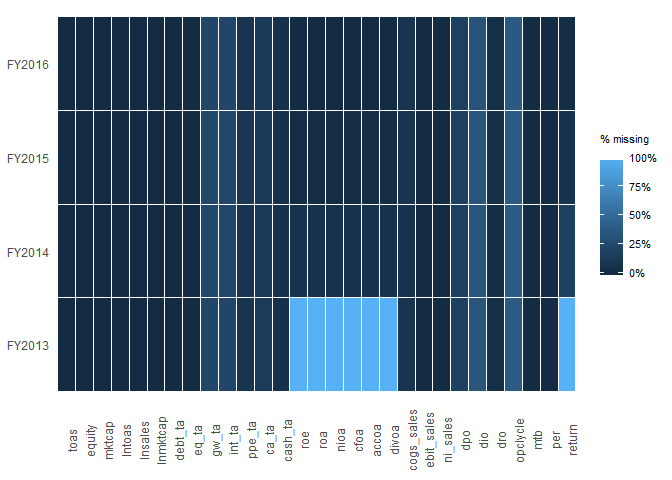
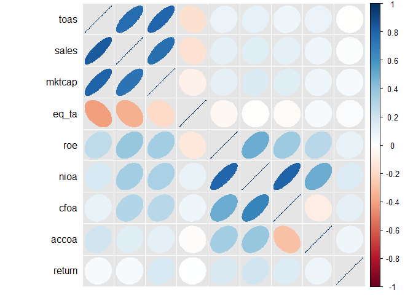
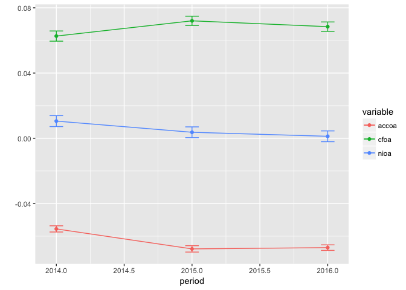
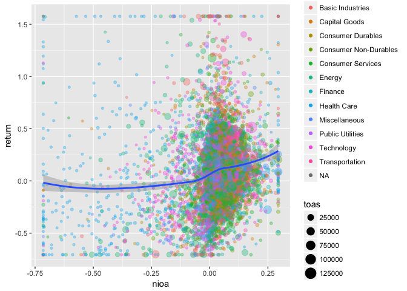

ExPanDaR: An Intro
================
Joachim Gassen
January 7, 2018

ExPanDaR Package Functions
--------------------------

You are visiting the gihub repository of the ExPanDaR (Explore Panel Data with R) package. ExPanDaR is a small and extremly early stage R package that is being developed to provide the code base for the ExPanD web app. ExPanD is a shiny based app designed to enable users with little or no statistical programming experience to explore panel data. In addition, it will serve as a front end to assess the robustness of empirical archival research work.

The auxiliary functions of the ExPanDaR package can also be used for rapid prototyping data analysis. The functions provided by ExPanDaR are designed to support analysis steps that are common with empirical archival research projects in the area of accounting and finance (which happens to be my field).

To see what ExPanDaR has to offer, let's take a quick tour.

### Data Preparation

The ExPanDaR package expects you to start with a data frame containing your panel data (meaning data with a cross-sectional dimension and something like a time dimension). However, you can also use some functions on simple cross-sectional data. ExPanDaR expects the cross-sectional identifiers to be factors and the time-series identifier to be an ordered factor. For this walk-through I will use the data set russel\_3000, which comes with the package. It contains some financial reporting and capital market data of Russell 3000 firms from Google Finance and Yahoo Finance and has been collected using the tidyquant package in the summer of 2017. The data was collected to showcase the functions of ExPanDaR in its natural habitat but I would advise against using this data for scientific work.

First, let's eyeball how frequently observations are missing in the data set.

``` r
data("russell_3000")
prepare_missing_values_graph(russell_3000, period = "period")
```



OK. This does not look to bad. Only 2013 seems odd, as some variables are completely missing. Guess why? They are calculated using lagged values of total assets. So, in the following, let's focus on the variables that we care about and the sample on the years 2014 to 2016 (a short panel, I know). Also, let's take a quick look at the descriptive statistics.

``` r
r3 <- russell_3000[russell_3000$period > "FY2013",
                   c("coid", "coname", "period", "sector", "toas", "mktcap", "lntoas",
            "eq_ta", "int_ta", "roe", "nioa", "cfoa", "accoa", "return")]
t <- prepare_descriptive_table(r3)
t$kable_ret  %>%
  kable_styling("condensed", full_width = F, position = "center")
```

<table class="table table-condensed" style="width: auto !important; margin-left: auto; margin-right: auto;">
<caption>
Descriptive Statistics
</caption>
<thead>
<tr>
<th style="text-align:left;">
</th>
<th style="text-align:right;">
N
</th>
<th style="text-align:right;">
Mean
</th>
<th style="text-align:right;">
Std. dev.
</th>
<th style="text-align:right;">
Min.
</th>
<th style="text-align:right;">
25 %
</th>
<th style="text-align:right;">
Median
</th>
<th style="text-align:right;">
75 %
</th>
<th style="text-align:right;">
Max.
</th>
</tr>
</thead>
<tbody>
<tr>
<td style="text-align:left;">
toas
</td>
<td style="text-align:right;">
6,703
</td>
<td style="text-align:right;">
9,036.222
</td>
<td style="text-align:right;">
37,725.783
</td>
<td style="text-align:right;">
0.800
</td>
<td style="text-align:right;">
467.435
</td>
<td style="text-align:right;">
1,629.320
</td>
<td style="text-align:right;">
5,135.450
</td>
<td style="text-align:right;">
861,395.000
</td>
</tr>
<tr>
<td style="text-align:left;">
mktcap
</td>
<td style="text-align:right;">
6,677
</td>
<td style="text-align:right;">
10,038.695
</td>
<td style="text-align:right;">
37,394.508
</td>
<td style="text-align:right;">
18.670
</td>
<td style="text-align:right;">
621.020
</td>
<td style="text-align:right;">
1,860.000
</td>
<td style="text-align:right;">
5,890.000
</td>
<td style="text-align:right;">
753,720.000
</td>
</tr>
<tr>
<td style="text-align:left;">
lntoas
</td>
<td style="text-align:right;">
6,703
</td>
<td style="text-align:right;">
7.427
</td>
<td style="text-align:right;">
1.747
</td>
<td style="text-align:right;">
-0.223
</td>
<td style="text-align:right;">
6.147
</td>
<td style="text-align:right;">
7.396
</td>
<td style="text-align:right;">
8.544
</td>
<td style="text-align:right;">
13.666
</td>
</tr>
<tr>
<td style="text-align:left;">
eq\_ta
</td>
<td style="text-align:right;">
6,703
</td>
<td style="text-align:right;">
0.426
</td>
<td style="text-align:right;">
0.314
</td>
<td style="text-align:right;">
-5.262
</td>
<td style="text-align:right;">
0.275
</td>
<td style="text-align:right;">
0.439
</td>
<td style="text-align:right;">
0.614
</td>
<td style="text-align:right;">
1.172
</td>
</tr>
<tr>
<td style="text-align:left;">
int\_ta
</td>
<td style="text-align:right;">
5,157
</td>
<td style="text-align:right;">
0.098
</td>
<td style="text-align:right;">
0.117
</td>
<td style="text-align:right;">
-0.008
</td>
<td style="text-align:right;">
0.018
</td>
<td style="text-align:right;">
0.057
</td>
<td style="text-align:right;">
0.139
</td>
<td style="text-align:right;">
0.871
</td>
</tr>
<tr>
<td style="text-align:left;">
roe
</td>
<td style="text-align:right;">
6,543
</td>
<td style="text-align:right;">
Inf
</td>
<td style="text-align:right;">
NaN
</td>
<td style="text-align:right;">
-357.513
</td>
<td style="text-align:right;">
-0.014
</td>
<td style="text-align:right;">
0.090
</td>
<td style="text-align:right;">
0.181
</td>
<td style="text-align:right;">
Inf
</td>
</tr>
<tr>
<td style="text-align:left;">
nioa
</td>
<td style="text-align:right;">
6,544
</td>
<td style="text-align:right;">
0.016
</td>
<td style="text-align:right;">
2.513
</td>
<td style="text-align:right;">
-23.519
</td>
<td style="text-align:right;">
-0.003
</td>
<td style="text-align:right;">
0.036
</td>
<td style="text-align:right;">
0.078
</td>
<td style="text-align:right;">
199.000
</td>
</tr>
<tr>
<td style="text-align:left;">
cfoa
</td>
<td style="text-align:right;">
6,544
</td>
<td style="text-align:right;">
0.124
</td>
<td style="text-align:right;">
4.938
</td>
<td style="text-align:right;">
-14.477
</td>
<td style="text-align:right;">
0.045
</td>
<td style="text-align:right;">
0.086
</td>
<td style="text-align:right;">
0.137
</td>
<td style="text-align:right;">
398.643
</td>
</tr>
<tr>
<td style="text-align:left;">
accoa
</td>
<td style="text-align:right;">
6,544
</td>
<td style="text-align:right;">
-0.108
</td>
<td style="text-align:right;">
2.500
</td>
<td style="text-align:right;">
-199.643
</td>
<td style="text-align:right;">
-0.096
</td>
<td style="text-align:right;">
-0.053
</td>
<td style="text-align:right;">
-0.024
</td>
<td style="text-align:right;">
3.442
</td>
</tr>
<tr>
<td style="text-align:left;">
return
</td>
<td style="text-align:right;">
6,115
</td>
<td style="text-align:right;">
0.097
</td>
<td style="text-align:right;">
0.437
</td>
<td style="text-align:right;">
-0.938
</td>
<td style="text-align:right;">
-0.138
</td>
<td style="text-align:right;">
0.065
</td>
<td style="text-align:right;">
0.269
</td>
<td style="text-align:right;">
6.346
</td>
</tr>
</tbody>
</table>
Take a look at the minima and the maxima of some of the variables (e.g., return on equity (roe)). This does not look nice. One thing that comes very handy when dealing with outliers is a quick way to observe extreme values.

``` r
t <- prepare_ext_obs_table(na.omit(r3[c("coname", "period", "roe")]))
t$kable_ret %>%
  kable_styling("condensed", full_width = F, position = "center")
```

<table class="table table-condensed" style="width: auto !important; margin-left: auto; margin-right: auto;">
<thead>
<tr>
<th style="text-align:left;">
coname
</th>
<th style="text-align:left;">
period
</th>
<th style="text-align:right;">
roe
</th>
</tr>
</thead>
<tbody>
<tr>
<td style="text-align:left;">
Medley Management Inc.
</td>
<td style="text-align:left;">
FY2014
</td>
<td style="text-align:right;">
Inf
</td>
</tr>
<tr>
<td style="text-align:left;">
National Storage Affiliates Trust
</td>
<td style="text-align:left;">
FY2015
</td>
<td style="text-align:right;">
Inf
</td>
</tr>
<tr>
<td style="text-align:left;">
AgroFresh Solutions, Inc.
</td>
<td style="text-align:left;">
FY2014
</td>
<td style="text-align:right;">
928.667
</td>
</tr>
<tr>
<td style="text-align:left;">
Adverum Biotechnologies, Inc.
</td>
<td style="text-align:left;">
FY2014
</td>
<td style="text-align:right;">
115.455
</td>
</tr>
<tr>
<td style="text-align:left;">
Crown Holdings, Inc.
</td>
<td style="text-align:left;">
FY2014
</td>
<td style="text-align:right;">
96.750
</td>
</tr>
<tr>
<td style="text-align:left;">
...
</td>
<td style="text-align:left;">
...
</td>
<td style="text-align:right;">
...
</td>
</tr>
<tr>
<td style="text-align:left;">
Rockwell Medical, Inc.
</td>
<td style="text-align:left;">
FY2014
</td>
<td style="text-align:right;">
-35.550
</td>
</tr>
<tr>
<td style="text-align:left;">
CytomX Therapeutics, Inc.
</td>
<td style="text-align:left;">
FY2014
</td>
<td style="text-align:right;">
-68.886
</td>
</tr>
<tr>
<td style="text-align:left;">
FairPoint Communications, Inc.
</td>
<td style="text-align:left;">
FY2016
</td>
<td style="text-align:right;">
-69.859
</td>
</tr>
<tr>
<td style="text-align:left;">
Concert Pharmaceuticals, Inc.
</td>
<td style="text-align:left;">
FY2014
</td>
<td style="text-align:right;">
-226.429
</td>
</tr>
<tr>
<td style="text-align:left;">
Scientific Games Corp
</td>
<td style="text-align:left;">
FY2015
</td>
<td style="text-align:right;">
-357.513
</td>
</tr>
</tbody>
</table>
In a real life research situation, you might want to take a break and check your data as well as the actual financial statements to see what is going on. In most cases, you will see that the outliers are caused by very small denominators (lagged equity values in this case). To reduce the effect of these outliers on your analysis, you can winsorize (or truncate) them.

``` r
r3win <- as.data.frame(treat_outliers(r3, percentile = 0.01))
t <- prepare_ext_obs_table(na.omit(r3win[c("coname", "period", "roe")]))
t$kable_ret %>%
  kable_styling("condensed", full_width = F, position = "center")
```

<table class="table table-condensed" style="width: auto !important; margin-left: auto; margin-right: auto;">
<thead>
<tr>
<th style="text-align:left;">
coname
</th>
<th style="text-align:left;">
period
</th>
<th style="text-align:right;">
roe
</th>
</tr>
</thead>
<tbody>
<tr>
<td style="text-align:left;">
American Airlines Group, Inc.
</td>
<td style="text-align:left;">
FY2015
</td>
<td style="text-align:right;">
3.225
</td>
</tr>
<tr>
<td style="text-align:left;">
Adverum Biotechnologies, Inc.
</td>
<td style="text-align:left;">
FY2014
</td>
<td style="text-align:right;">
3.225
</td>
</tr>
<tr>
<td style="text-align:left;">
Agenus Inc.
</td>
<td style="text-align:left;">
FY2014
</td>
<td style="text-align:right;">
3.225
</td>
</tr>
<tr>
<td style="text-align:left;">
AgroFresh Solutions, Inc.
</td>
<td style="text-align:left;">
FY2014
</td>
<td style="text-align:right;">
3.225
</td>
</tr>
<tr>
<td style="text-align:left;">
Allegion plc
</td>
<td style="text-align:left;">
FY2016
</td>
<td style="text-align:right;">
3.225
</td>
</tr>
<tr>
<td style="text-align:left;">
...
</td>
<td style="text-align:left;">
...
</td>
<td style="text-align:right;">
...
</td>
</tr>
<tr>
<td style="text-align:left;">
2U, Inc.
</td>
<td style="text-align:left;">
FY2014
</td>
<td style="text-align:right;">
-3.263
</td>
</tr>
<tr>
<td style="text-align:left;">
Varonis Systems, Inc.
</td>
<td style="text-align:left;">
FY2014
</td>
<td style="text-align:right;">
-3.263
</td>
</tr>
<tr>
<td style="text-align:left;">
Wynn Resorts, Limited
</td>
<td style="text-align:left;">
FY2014
</td>
<td style="text-align:right;">
-3.263
</td>
</tr>
<tr>
<td style="text-align:left;">
Wynn Resorts, Limited
</td>
<td style="text-align:left;">
FY2015
</td>
<td style="text-align:right;">
-3.263
</td>
</tr>
<tr>
<td style="text-align:left;">
ZIOPHARM Oncology Inc
</td>
<td style="text-align:left;">
FY2015
</td>
<td style="text-align:right;">
-3.263
</td>
</tr>
</tbody>
</table>
### Descriptive Statistics

Still rather extreme values (Return on equity = 322 %) but let's move on and look at the winsorized descriptive statistics.

``` r
t <- prepare_descriptive_table(r3win)
t$kable_ret  %>%
  kable_styling("condensed", full_width = F, position = "center")
```

<table class="table table-condensed" style="width: auto !important; margin-left: auto; margin-right: auto;">
<caption>
Descriptive Statistics
</caption>
<thead>
<tr>
<th style="text-align:left;">
</th>
<th style="text-align:right;">
N
</th>
<th style="text-align:right;">
Mean
</th>
<th style="text-align:right;">
Std. dev.
</th>
<th style="text-align:right;">
Min.
</th>
<th style="text-align:right;">
25 %
</th>
<th style="text-align:right;">
Median
</th>
<th style="text-align:right;">
75 %
</th>
<th style="text-align:right;">
Max.
</th>
</tr>
</thead>
<tbody>
<tr>
<td style="text-align:left;">
toas
</td>
<td style="text-align:right;">
6,703
</td>
<td style="text-align:right;">
7,390.704
</td>
<td style="text-align:right;">
18,408.996
</td>
<td style="text-align:right;">
45.622
</td>
<td style="text-align:right;">
467.435
</td>
<td style="text-align:right;">
1,629.320
</td>
<td style="text-align:right;">
5,135.450
</td>
<td style="text-align:right;">
129,488.840
</td>
</tr>
<tr>
<td style="text-align:left;">
mktcap
</td>
<td style="text-align:right;">
6,677
</td>
<td style="text-align:right;">
8,738.255
</td>
<td style="text-align:right;">
23,169.558
</td>
<td style="text-align:right;">
86.428
</td>
<td style="text-align:right;">
621.020
</td>
<td style="text-align:right;">
1,860.000
</td>
<td style="text-align:right;">
5,890.000
</td>
<td style="text-align:right;">
174,450.000
</td>
</tr>
<tr>
<td style="text-align:left;">
lntoas
</td>
<td style="text-align:right;">
6,703
</td>
<td style="text-align:right;">
7.427
</td>
<td style="text-align:right;">
1.713
</td>
<td style="text-align:right;">
3.820
</td>
<td style="text-align:right;">
6.147
</td>
<td style="text-align:right;">
7.396
</td>
<td style="text-align:right;">
8.544
</td>
<td style="text-align:right;">
11.771
</td>
</tr>
<tr>
<td style="text-align:left;">
eq\_ta
</td>
<td style="text-align:right;">
6,703
</td>
<td style="text-align:right;">
0.433
</td>
<td style="text-align:right;">
0.263
</td>
<td style="text-align:right;">
-0.455
</td>
<td style="text-align:right;">
0.275
</td>
<td style="text-align:right;">
0.439
</td>
<td style="text-align:right;">
0.614
</td>
<td style="text-align:right;">
0.931
</td>
</tr>
<tr>
<td style="text-align:left;">
int\_ta
</td>
<td style="text-align:right;">
5,157
</td>
<td style="text-align:right;">
0.097
</td>
<td style="text-align:right;">
0.111
</td>
<td style="text-align:right;">
0.000
</td>
<td style="text-align:right;">
0.018
</td>
<td style="text-align:right;">
0.057
</td>
<td style="text-align:right;">
0.139
</td>
<td style="text-align:right;">
0.576
</td>
</tr>
<tr>
<td style="text-align:left;">
roe
</td>
<td style="text-align:right;">
6,543
</td>
<td style="text-align:right;">
0.052
</td>
<td style="text-align:right;">
0.635
</td>
<td style="text-align:right;">
-3.263
</td>
<td style="text-align:right;">
-0.014
</td>
<td style="text-align:right;">
0.090
</td>
<td style="text-align:right;">
0.181
</td>
<td style="text-align:right;">
3.225
</td>
</tr>
<tr>
<td style="text-align:left;">
nioa
</td>
<td style="text-align:right;">
6,544
</td>
<td style="text-align:right;">
0.001
</td>
<td style="text-align:right;">
0.187
</td>
<td style="text-align:right;">
-1.014
</td>
<td style="text-align:right;">
-0.003
</td>
<td style="text-align:right;">
0.036
</td>
<td style="text-align:right;">
0.078
</td>
<td style="text-align:right;">
0.345
</td>
</tr>
<tr>
<td style="text-align:left;">
cfoa
</td>
<td style="text-align:right;">
6,544
</td>
<td style="text-align:right;">
0.069
</td>
<td style="text-align:right;">
0.162
</td>
<td style="text-align:right;">
-0.765
</td>
<td style="text-align:right;">
0.045
</td>
<td style="text-align:right;">
0.086
</td>
<td style="text-align:right;">
0.137
</td>
<td style="text-align:right;">
0.437
</td>
</tr>
<tr>
<td style="text-align:left;">
accoa
</td>
<td style="text-align:right;">
6,544
</td>
<td style="text-align:right;">
-0.069
</td>
<td style="text-align:right;">
0.102
</td>
<td style="text-align:right;">
-0.557
</td>
<td style="text-align:right;">
-0.096
</td>
<td style="text-align:right;">
-0.053
</td>
<td style="text-align:right;">
-0.024
</td>
<td style="text-align:right;">
0.239
</td>
</tr>
<tr>
<td style="text-align:left;">
return
</td>
<td style="text-align:right;">
6,115
</td>
<td style="text-align:right;">
0.088
</td>
<td style="text-align:right;">
0.375
</td>
<td style="text-align:right;">
-0.706
</td>
<td style="text-align:right;">
-0.138
</td>
<td style="text-align:right;">
0.065
</td>
<td style="text-align:right;">
0.269
</td>
<td style="text-align:right;">
1.576
</td>
</tr>
</tbody>
</table>
This looks better. I am sure that you won't care but I am a big fan of correlation tables.

``` r
t<- prepare_correlation_table(r3win, bold = 0.01, format="html")
t$kable_ret %>%
  kable_styling("condensed", full_width = F, position = "center")
```

<table class="table table-condensed" style="width: auto !important; margin-left: auto; margin-right: auto;">
<thead>
<tr>
<th style="text-align:left;">
</th>
<th style="text-align:right;">
A
</th>
<th style="text-align:right;">
B
</th>
<th style="text-align:right;">
C
</th>
<th style="text-align:right;">
D
</th>
<th style="text-align:right;">
E
</th>
<th style="text-align:right;">
F
</th>
<th style="text-align:right;">
G
</th>
<th style="text-align:right;">
H
</th>
<th style="text-align:right;">
I
</th>
<th style="text-align:right;">
J
</th>
</tr>
</thead>
<tbody>
<tr>
<td style="text-align:left;">
A: toas
</td>
<td style="text-align:right;">
</td>
<td style="text-align:right;">
<span style=" font-weight: bold;  ">0.79</span>
</td>
<td style="text-align:right;">
<span style=" font-weight: bold;  ">0.65</span>
</td>
<td style="text-align:right;">
<span style=" font-weight: bold;  ">-0.16</span>
</td>
<td style="text-align:right;">
<span style="   ">0.02</span>
</td>
<td style="text-align:right;">
<span style=" font-weight: bold;  ">0.07</span>
</td>
<td style="text-align:right;">
<span style=" font-weight: bold;  ">0.10</span>
</td>
<td style="text-align:right;">
<span style=" font-weight: bold;  ">0.06</span>
</td>
<td style="text-align:right;">
<span style=" font-weight: bold;  ">0.08</span>
</td>
<td style="text-align:right;">
<span style="   ">-0.00</span>
</td>
</tr>
<tr>
<td style="text-align:left;">
B: mktcap
</td>
<td style="text-align:right;">
<span style=" font-weight: bold;  ">0.80</span>
</td>
<td style="text-align:right;">
</td>
<td style="text-align:right;">
<span style=" font-weight: bold;  ">0.56</span>
</td>
<td style="text-align:right;">
<span style=" font-weight: bold;  ">-0.08</span>
</td>
<td style="text-align:right;">
<span style=" font-weight: bold;  ">0.06</span>
</td>
<td style="text-align:right;">
<span style=" font-weight: bold;  ">0.09</span>
</td>
<td style="text-align:right;">
<span style=" font-weight: bold;  ">0.14</span>
</td>
<td style="text-align:right;">
<span style=" font-weight: bold;  ">0.13</span>
</td>
<td style="text-align:right;">
<span style=" font-weight: bold;  ">0.06</span>
</td>
<td style="text-align:right;">
<span style=" font-weight: bold;  ">0.04</span>
</td>
</tr>
<tr>
<td style="text-align:left;">
C: lntoas
</td>
<td style="text-align:right;">
<span style=" font-weight: bold;  ">1.00</span>
</td>
<td style="text-align:right;">
<span style=" font-weight: bold;  ">0.80</span>
</td>
<td style="text-align:right;">
</td>
<td style="text-align:right;">
<span style=" font-weight: bold;  ">-0.34</span>
</td>
<td style="text-align:right;">
<span style=" font-weight: bold;  ">0.04</span>
</td>
<td style="text-align:right;">
<span style=" font-weight: bold;  ">0.13</span>
</td>
<td style="text-align:right;">
<span style=" font-weight: bold;  ">0.32</span>
</td>
<td style="text-align:right;">
<span style=" font-weight: bold;  ">0.25</span>
</td>
<td style="text-align:right;">
<span style=" font-weight: bold;  ">0.20</span>
</td>
<td style="text-align:right;">
<span style="   ">-0.02</span>
</td>
</tr>
<tr>
<td style="text-align:left;">
D: eq\_ta
</td>
<td style="text-align:right;">
<span style=" font-weight: bold;  ">-0.42</span>
</td>
<td style="text-align:right;">
<span style=" font-weight: bold;  ">-0.20</span>
</td>
<td style="text-align:right;">
<span style=" font-weight: bold;  ">-0.42</span>
</td>
<td style="text-align:right;">
</td>
<td style="text-align:right;">
<span style=" font-weight: bold;  ">-0.10</span>
</td>
<td style="text-align:right;">
<span style=" font-weight: bold;  ">-0.04</span>
</td>
<td style="text-align:right;">
<span style="   ">-0.03</span>
</td>
<td style="text-align:right;">
<span style=" font-weight: bold;  ">-0.03</span>
</td>
<td style="text-align:right;">
<span style="   ">0.01</span>
</td>
<td style="text-align:right;">
<span style="   ">0.03</span>
</td>
</tr>
<tr>
<td style="text-align:left;">
E: int\_ta
</td>
<td style="text-align:right;">
<span style="   ">0.03</span>
</td>
<td style="text-align:right;">
<span style=" font-weight: bold;  ">0.05</span>
</td>
<td style="text-align:right;">
<span style="   ">0.03</span>
</td>
<td style="text-align:right;">
<span style=" font-weight: bold;  ">-0.06</span>
</td>
<td style="text-align:right;">
</td>
<td style="text-align:right;">
<span style="   ">0.02</span>
</td>
<td style="text-align:right;">
<span style="   ">0.01</span>
</td>
<td style="text-align:right;">
<span style="   ">0.02</span>
</td>
<td style="text-align:right;">
<span style="   ">-0.00</span>
</td>
<td style="text-align:right;">
<span style="   ">-0.02</span>
</td>
</tr>
<tr>
<td style="text-align:left;">
F: roe
</td>
<td style="text-align:right;">
<span style=" font-weight: bold;  ">0.23</span>
</td>
<td style="text-align:right;">
<span style=" font-weight: bold;  ">0.32</span>
</td>
<td style="text-align:right;">
<span style=" font-weight: bold;  ">0.23</span>
</td>
<td style="text-align:right;">
<span style=" font-weight: bold;  ">-0.10</span>
</td>
<td style="text-align:right;">
<span style="   ">0.02</span>
</td>
<td style="text-align:right;">
</td>
<td style="text-align:right;">
<span style=" font-weight: bold;  ">0.38</span>
</td>
<td style="text-align:right;">
<span style=" font-weight: bold;  ">0.27</span>
</td>
<td style="text-align:right;">
<span style=" font-weight: bold;  ">0.24</span>
</td>
<td style="text-align:right;">
<span style=" font-weight: bold;  ">0.08</span>
</td>
</tr>
<tr>
<td style="text-align:left;">
G: nioa
</td>
<td style="text-align:right;">
<span style=" font-weight: bold;  ">0.17</span>
</td>
<td style="text-align:right;">
<span style=" font-weight: bold;  ">0.32</span>
</td>
<td style="text-align:right;">
<span style=" font-weight: bold;  ">0.17</span>
</td>
<td style="text-align:right;">
<span style=" font-weight: bold;  ">0.10</span>
</td>
<td style="text-align:right;">
<span style="   ">0.04</span>
</td>
<td style="text-align:right;">
<span style=" font-weight: bold;  ">0.77</span>
</td>
<td style="text-align:right;">
</td>
<td style="text-align:right;">
<span style=" font-weight: bold;  ">0.81</span>
</td>
<td style="text-align:right;">
<span style=" font-weight: bold;  ">0.51</span>
</td>
<td style="text-align:right;">
<span style=" font-weight: bold;  ">0.11</span>
</td>
</tr>
<tr>
<td style="text-align:left;">
H: cfoa
</td>
<td style="text-align:right;">
<span style=" font-weight: bold;  ">0.08</span>
</td>
<td style="text-align:right;">
<span style=" font-weight: bold;  ">0.27</span>
</td>
<td style="text-align:right;">
<span style=" font-weight: bold;  ">0.08</span>
</td>
<td style="text-align:right;">
<span style=" font-weight: bold;  ">0.07</span>
</td>
<td style="text-align:right;">
<span style=" font-weight: bold;  ">0.07</span>
</td>
<td style="text-align:right;">
<span style=" font-weight: bold;  ">0.48</span>
</td>
<td style="text-align:right;">
<span style=" font-weight: bold;  ">0.66</span>
</td>
<td style="text-align:right;">
</td>
<td style="text-align:right;">
<span style=" font-weight: bold;  ">-0.04</span>
</td>
<td style="text-align:right;">
<span style=" font-weight: bold;  ">0.11</span>
</td>
</tr>
<tr>
<td style="text-align:left;">
I: accoa
</td>
<td style="text-align:right;">
<span style=" font-weight: bold;  ">0.21</span>
</td>
<td style="text-align:right;">
<span style=" font-weight: bold;  ">0.12</span>
</td>
<td style="text-align:right;">
<span style=" font-weight: bold;  ">0.21</span>
</td>
<td style="text-align:right;">
<span style="   ">-0.02</span>
</td>
<td style="text-align:right;">
<span style="   ">-0.03</span>
</td>
<td style="text-align:right;">
<span style=" font-weight: bold;  ">0.33</span>
</td>
<td style="text-align:right;">
<span style=" font-weight: bold;  ">0.38</span>
</td>
<td style="text-align:right;">
<span style=" font-weight: bold;  ">-0.29</span>
</td>
<td style="text-align:right;">
</td>
<td style="text-align:right;">
<span style="   ">0.02</span>
</td>
</tr>
<tr>
<td style="text-align:left;">
J: return
</td>
<td style="text-align:right;">
<span style=" font-weight: bold;  ">0.04</span>
</td>
<td style="text-align:right;">
<span style=" font-weight: bold;  ">0.17</span>
</td>
<td style="text-align:right;">
<span style=" font-weight: bold;  ">0.04</span>
</td>
<td style="text-align:right;">
<span style="   ">0.01</span>
</td>
<td style="text-align:right;">
<span style="   ">0.01</span>
</td>
<td style="text-align:right;">
<span style=" font-weight: bold;  ">0.18</span>
</td>
<td style="text-align:right;">
<span style=" font-weight: bold;  ">0.20</span>
</td>
<td style="text-align:right;">
<span style=" font-weight: bold;  ">0.16</span>
</td>
<td style="text-align:right;">
<span style=" font-weight: bold;  ">0.06</span>
</td>
<td style="text-align:right;">
</td>
</tr>
</tbody>
<tfoot>
<tr>
<td style="padding: 0; border: 0;" colspan="100%">
<sup></sup> This table reports Pearson correlations above and Spearman correlations below the diagonal. The number of observations ranges from 4743 to 6703. Correlations with significance levels below 1% appear in bold print.
</td>
</tr>
</tfoot>
</table>
In fact, I like them so much that I sometimes use a graphic variant based on the corrplot package. See for yourself.

``` r
prepare_correlation_graph(r3win)
```



### Visuals

Additional visuals are available for exploring time trends. For comparing variables...

``` r
graph <- prepare_trend_graph(r3win[c("period", "nioa", "cfoa", "accoa")], "period")
```

    ## Warning: package 'bindrcpp' was built under R version 3.3.3

``` r
graph$plot
```



... and for eyeballing the distributional properties of a single variable over time.

``` r
graph <- prepare_quantile_trend_graph(r3win[c("period", "return")], "period", c(0.05, 0.25, 0.5, 0.75, 0.95))
graph$plot
```


And, of course, the mother of all plots, the scatter plot. Do you see the structural break around nioa == 0? Accountants like that kind of stuff.

``` r
prepare_scatter_plot(r3win, x="nioa", y="return", color="sector", size="lntoas", loess = 1)
```

    ## Warning: Removed 596 rows containing non-finite values (stat_smooth).

    ## Warning: Removed 599 rows containing missing values (geom_point).



### Regression Tables

And, if you happen to be a fan of starred numbers, you can also quickly produce regression tables. Both, by mixing different models...

``` r
dvs <- list("return", "return", "return", "return", "return", "return")
idvs <- list(c("nioa"), 
             c("cfoa"), 
             c("cfoa", "accoa"), 
             c("cfoa", "accoa"), 
             c("cfoa", "accoa"), 
             c("cfoa", "accoa")) 
feffects <- list("period", "period", "period", c("period", "sector"), c("period", "coid"), c("period", "coid"))
clusters <- list("", "", "", "period", c("period", "sector"), c("period", "coid"))
t <- prepare_regression_table(r3win, dvs, idvs, feffects, clusters)
htmltools::HTML(t$table)
```

<!--html_preserve-->
<table style="text-align:center">
<tr>
<td colspan="7" style="border-bottom: 1px solid black">
</td>
</tr>
<tr>
<td style="text-align:left">
</td>
<td colspan="6">
<em>Dependent variable:</em>
</td>
</tr>
<tr>
<td>
</td>
<td colspan="6" style="border-bottom: 1px solid black">
</td>
</tr>
<tr>
<td style="text-align:left">
</td>
<td>
return
</td>
<td>
return
</td>
<td colspan="4">
return
</td>
</tr>
<tr>
<td style="text-align:left">
</td>
<td>
(1)
</td>
<td>
(2)
</td>
<td>
(3)
</td>
<td>
(4)
</td>
<td>
(5)
</td>
<td>
(6)
</td>
</tr>
<tr>
<td colspan="7" style="border-bottom: 1px solid black">
</td>
</tr>
<tr>
<td style="text-align:left">
nioa
</td>
<td>
0.251<sup>\*\*\*</sup>
</td>
<td>
</td>
<td>
</td>
<td>
</td>
<td>
</td>
<td>
</td>
</tr>
<tr>
<td style="text-align:left">
</td>
<td>
(0.028)
</td>
<td>
</td>
<td>
</td>
<td>
</td>
<td>
</td>
<td>
</td>
</tr>
<tr>
<td style="text-align:left">
</td>
<td>
</td>
<td>
</td>
<td>
</td>
<td>
</td>
<td>
</td>
<td>
</td>
</tr>
<tr>
<td style="text-align:left">
cfoa
</td>
<td>
</td>
<td>
0.276<sup>\*\*\*</sup>
</td>
<td>
0.284<sup>\*\*\*</sup>
</td>
<td>
0.342<sup>\*\*\*</sup>
</td>
<td>
0.374
</td>
<td>
0.374<sup>\*</sup>
</td>
</tr>
<tr>
<td style="text-align:left">
</td>
<td>
</td>
<td>
(0.032)
</td>
<td>
(0.032)
</td>
<td>
(0.093)
</td>
<td>
(0.299)
</td>
<td>
(0.218)
</td>
</tr>
<tr>
<td style="text-align:left">
</td>
<td>
</td>
<td>
</td>
<td>
</td>
<td>
</td>
<td>
</td>
<td>
</td>
</tr>
<tr>
<td style="text-align:left">
accoa
</td>
<td>
</td>
<td>
</td>
<td>
0.122<sup>\*\*</sup>
</td>
<td>
0.096
</td>
<td>
0.115
</td>
<td>
0.115
</td>
</tr>
<tr>
<td style="text-align:left">
</td>
<td>
</td>
<td>
</td>
<td>
(0.051)
</td>
<td>
(0.139)
</td>
<td>
(0.386)
</td>
<td>
(0.347)
</td>
</tr>
<tr>
<td style="text-align:left">
</td>
<td>
</td>
<td>
</td>
<td>
</td>
<td>
</td>
<td>
</td>
<td>
</td>
</tr>
<tr>
<td colspan="7" style="border-bottom: 1px solid black">
</td>
</tr>
<tr>
<td style="text-align:left">
Fixed effects
</td>
<td>
period
</td>
<td>
period
</td>
<td>
period
</td>
<td>
period, sector
</td>
<td>
period, coid
</td>
<td>
period, coid
</td>
</tr>
<tr>
<td style="text-align:left">
Std. errors clustered
</td>
<td>
No
</td>
<td>
No
</td>
<td>
No
</td>
<td>
period
</td>
<td>
period, sector
</td>
<td>
period, coid
</td>
</tr>
<tr>
<td style="text-align:left">
Observations
</td>
<td>
6,111
</td>
<td>
6,111
</td>
<td>
6,111
</td>
<td>
6,096
</td>
<td>
6,096
</td>
<td>
6,111
</td>
</tr>
<tr>
<td style="text-align:left">
R<sup>2</sup>
</td>
<td>
0.043
</td>
<td>
0.042
</td>
<td>
0.043
</td>
<td>
0.052
</td>
<td>
0.328
</td>
<td>
0.329
</td>
</tr>
<tr>
<td style="text-align:left">
Adjusted R<sup>2</sup>
</td>
<td>
0.042
</td>
<td>
0.042
</td>
<td>
0.043
</td>
<td>
0.050
</td>
<td>
-0.058
</td>
<td>
-0.057
</td>
</tr>
<tr>
<td colspan="7" style="border-bottom: 1px solid black">
</td>
</tr>
<tr>
<td style="text-align:left">
<em>Note:</em>
</td>
<td colspan="6" style="text-align:right">
<sup>*</sup>p&lt;0.1; <sup>**</sup>p&lt;0.05; <sup>***</sup>p&lt;0.01
</td>
</tr>
</table>
<!--/html_preserve-->
... or by applying one model on different sub-samples.

``` r
t <- prepare_regression_table(r3win, "return", c("cfoa", "accoa"), byvar="period")
htmltools::HTML(t$table)
```

<!--html_preserve-->
<table style="text-align:center">
<tr>
<td colspan="5" style="border-bottom: 1px solid black">
</td>
</tr>
<tr>
<td style="text-align:left">
</td>
<td colspan="4">
<em>Dependent variable:</em>
</td>
</tr>
<tr>
<td>
</td>
<td colspan="4" style="border-bottom: 1px solid black">
</td>
</tr>
<tr>
<td style="text-align:left">
</td>
<td colspan="4">
return
</td>
</tr>
<tr>
<td style="text-align:left">
</td>
<td>
Full Sample
</td>
<td>
FY2013
</td>
<td>
FY2014
</td>
<td>
FY2015
</td>
</tr>
<tr>
<td style="text-align:left">
</td>
<td>
(1)
</td>
<td>
(2)
</td>
<td>
(3)
</td>
<td>
(4)
</td>
</tr>
<tr>
<td colspan="5" style="border-bottom: 1px solid black">
</td>
</tr>
<tr>
<td style="text-align:left">
cfoa
</td>
<td>
0.280<sup>\*\*\*</sup>
</td>
<td>
-0.007
</td>
<td>
0.215<sup>\*\*\*</sup>
</td>
<td>
0.591<sup>\*\*\*</sup>
</td>
</tr>
<tr>
<td style="text-align:left">
</td>
<td>
(0.033)
</td>
<td>
(0.057)
</td>
<td>
(0.055)
</td>
<td>
(0.054)
</td>
</tr>
<tr>
<td style="text-align:left">
</td>
<td>
</td>
<td>
</td>
<td>
</td>
<td>
</td>
</tr>
<tr>
<td style="text-align:left">
accoa
</td>
<td>
0.146<sup>\*\*\*</sup>
</td>
<td>
-0.081
</td>
<td>
0.355<sup>\*\*\*</sup>
</td>
<td>
-0.027
</td>
</tr>
<tr>
<td style="text-align:left">
</td>
<td>
(0.051)
</td>
<td>
(0.092)
</td>
<td>
(0.080)
</td>
<td>
(0.092)
</td>
</tr>
<tr>
<td style="text-align:left">
</td>
<td>
</td>
<td>
</td>
<td>
</td>
<td>
</td>
</tr>
<tr>
<td style="text-align:left">
Constant
</td>
<td>
0.076<sup>\*\*\*</sup>
</td>
<td>
0.128<sup>\*\*\*</sup>
</td>
<td>
0.005
</td>
<td>
0.093<sup>\*\*\*</sup>
</td>
</tr>
<tr>
<td style="text-align:left">
</td>
<td>
(0.006)
</td>
<td>
(0.010)
</td>
<td>
(0.010)
</td>
<td>
(0.011)
</td>
</tr>
<tr>
<td style="text-align:left">
</td>
<td>
</td>
<td>
</td>
<td>
</td>
<td>
</td>
</tr>
<tr>
<td colspan="5" style="border-bottom: 1px solid black">
</td>
</tr>
<tr>
<td style="text-align:left">
Fixed effects
</td>
<td>
None
</td>
<td>
None
</td>
<td>
None
</td>
<td>
None
</td>
</tr>
<tr>
<td style="text-align:left">
Std. errors clustered
</td>
<td>
No
</td>
<td>
No
</td>
<td>
No
</td>
<td>
No
</td>
</tr>
<tr>
<td style="text-align:left">
Observations
</td>
<td>
6,111
</td>
<td>
1,827
</td>
<td>
2,089
</td>
<td>
2,195
</td>
</tr>
<tr>
<td style="text-align:left">
R<sup>2</sup>
</td>
<td>
0.013
</td>
<td>
0.0004
</td>
<td>
0.015
</td>
<td>
0.051
</td>
</tr>
<tr>
<td style="text-align:left">
Adjusted R<sup>2</sup>
</td>
<td>
0.012
</td>
<td>
-0.001
</td>
<td>
0.014
</td>
<td>
0.051
</td>
</tr>
<tr>
<td colspan="5" style="border-bottom: 1px solid black">
</td>
</tr>
<tr>
<td style="text-align:left">
<em>Note:</em>
</td>
<td colspan="4" style="text-align:right">
<sup>*</sup>p&lt;0.1; <sup>**</sup>p&lt;0.05; <sup>***</sup>p&lt;0.01
</td>
</tr>
</table>
<!--/html_preserve-->
### Conclusion

This is all there is (currently). All these functions are rather simple wrappers around established R functions. They can easily be modified to fit your needs and taste. Enjoy!
