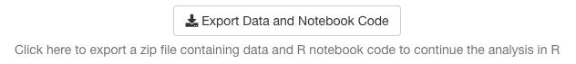

```{r setup, include = FALSE}
knitr::opts_chunk$set(
  echo = TRUE, 
  fig.align = "center", 
  fig.width = 6,
  warnings = FALSE
)

library(ExPanDaR)
library(knitr)
library(kableExtra)
library(ggplot2)

nb_df <- russell_3000
nb_df_def <- cbind(
  russell_3000_data_def, 
  can_be_na = c(rep(FALSE, 3), rep(TRUE, 21))
) 

nb_df_def$var_def <- sub('$', '\\$', nb_df_def$var_def, fixed = TRUE)

create_sample <- function(df, df_def) {
  # Set infinite numerical variables to NA
  df[, df_def$var_name[df_def$type == "numeric"]] <-
    lapply(df[, df_def$var_name[df_def$type == "numeric"]],
      function(x) ifelse(is.finite(x), x, NA))
 
  # Delete numerical variables that only contain NAs
  all_na_vars <- sapply(df, function (x) all(is.na(x)))
  df_def <- df_def[!all_na_vars,]
  df <- df[, df_def$var_name]
 
  # Drop observations that are NA in variables that are not allowed to
  df <- df[complete.cases(df[, df_def$var_name[which(df_def$can_be_na == FALSE)]]), ]
 
  # Outlier treatment as requested in ExPanD()
  nums <- df_def$var_name[df_def$type == "numeric"]
  df[, nums] <- treat_outliers(df[, nums], 0.01, FALSE, NULL)
 
  df <- droplevels(df)
  return(list(df = df, df_def = df_def))
}

smp_list <- create_sample(nb_df, nb_df_def)
smp <- smp_list$df
smp_def <- smp_list$df_def
```

## Exporting a Notebook from within ExPanD

When you start ExPanD with the parameter `export_nb_option = TRUE`, you can 
export an R notebook containing the current state of your analysis from within 
the ExPanD app. Let's see how that works and what the notebook has to offer. 
First, start ExPanD with the included panel data on U.S. corporations and the 
option to export notebooks.

```{r startExPanD, eval = FALSE}
library(ExPanDaR)

ExPanD(df = russell_3000,  
       df_def = russell_3000_data_def, 
       df_name = "Russell 3000",
       config_list = ExPanD_config_russell_3000,
       export_nb_option = TRUE)
```

Next, after scrolling to the bottom of the page and clicking on the button 
below,

```{r, out.width = "80%", fig.align="center", fig.border = "none", echo=FALSE}

```

you should be rewarded with a file download dialog, asking you to store a file
named `ExPanD_nb.zip`. Store and unzip it wherever you like. It contains two
files

- A notebook file `ExPanD_nb_code.Rmd` and
- a data file `ExPanD_nb_data.RData` containing data and variable definitions.

## Exploring the Notebook Code

Use RStudio to open the notebook file. You can directly knit it 
(`Preview/Knit to HTML`) but in order to work with and extend it, it is useful
to take a deeper look at its code first. The first chunk silently loads
required libraries and sets some knitting defaults. The second chunk is more 
interesting:

```{r create_sample, eval = FALSE}
create_sample <- function(df, df_def) {
  # Set infinite numerical variables to NA
  df[, df_def$var_name[df_def$type == "numeric"]] <-
    lapply(df[, df_def$var_name[df_def$type == "numeric"]],
      function(x) ifelse(is.finite(x), x, NA))
 
  # Delete numerical variables that only contain NAs
  all_na_vars <- sapply(df, function (x) all(is.na(x)))
  df_def <- df_def[!all_na_vars,]
  df <- df[, df_def$var_name]
 
  # Drop observations that are NA in variables that are not allowed to
  df <- df[complete.cases(df[, df_def$var_name[which(df_def$can_be_na == FALSE)]]), ]
 
  # Outlier treatment as requested in ExPanD()
  nums <- df_def$var_name[df_def$type == "numeric"]
  df[, nums] <- treat_outliers(df[, nums], 0.01, FALSE, NULL)
 
  df <- droplevels(df)
  return(list(df = df, df_def = df_def))
}
 
load("ExPanD_nb_data.Rdata")
 
smp_list <- create_sample(nb_df, nb_df_def)
smp <- smp_list$df
smp_def <- smp_list$df_def
```

If you are not that familiar yet with R, the above might look a little bit 
intimidating. Let's explore it step by step. The first large part of the code,
starting with `create_sample` and ending several lines later with the closing
curly bracket on a separate line defines a function. A function is a block of 
code that can take parameters and returns an object. The function is named 
`create_sample` and that is what it does: It creates the sample that is being
used in the analysis further below. You see that the function is being called 
after loading the data with the command `create_sample(nb_df, nb_df_def)`.
Let's look at the data that is passed on to the function before exploring
what the function does in detail. After loading `"ExPanD_nb_data.Rdata"`,
you have the data frames `nb_df` and `nb_df_def` in your environment. The first
contains the raw data for the analysis in long format. See:

```{r display_nb_df}
kable(head(nb_df[, 1:7]), row.names = FALSE)
```

What is the second data frame for? Let's have a peak:

```{r display_nb_df_def}
kable(nb_df_def, row.names = FALSE) 
```

So this data frame contains variable definitions and defines how ExPanD should 
treat the variables. `type` indicates the cross-sectional (`cs_id`) and time
series (`ts_id`) identifiers as well as whether the variables should be understood
as numeric, logical or as a factor. `can_be_na` indicates whether ExPanD should
require the variable to be not `NA`. If `can_be_na` is set to `FALSE` for a 
variable and its data is missing for a certain observation then ExPanD drops the 
whole observation (the row of the data frame) from the analysis.

The function `create_sample` now uses both data frames to prepare the sample
for the analysis. It first sets all non finite numerical values to `NA`. Next,
it checks whether any variables contain only `NA` observations and, if such
variables are present in the data frame, it deletes them. After that, 
observations with `NA` values for variables that have set `can_be_na = FALSE`
are deleted. Last, the outlier treatment as specified in the ExPanD app is 
applied to the data by calling the `ExPanDaR` function `treat_outliers()`. 
The default configuration that you used when calling ExPanD specified that the
data should be winsorized at the top and bottom 1% percentile, meaning that 
values above the top 1% or below the bottom 1% will be set to the respective
percentiles.

After these data preparation steps the modified data frames containing the data
and its definitions are returned to the user, wrapped into a list object. The 
last two commands store these data frames into `smp` and `smp_def`. The 
remaining code will use these data frames for the analysis.

The rest of the notebook is much easier to process. For example, the chunk

```{r bar_chart}
df <- smp
df$period <- as.factor(df$period)
df$sector <- as.factor(df$sector)
p <- ggplot(df, aes(x = period)) +
  geom_bar(aes(fill= sector), position = "stack") +
  labs(x = "period", fill = "sector")
p
```

provides a stacked bar chart of the ExPanD app.^[A remark for the R experts: Some
of the code of the analysis chunks (e.g. the `as.factor()` calls in the chunk 
above) is only needed because of the generic data types that ExPanD can handle 
and could be safely removed for a specific well-behaved data frame.]

When you look at the histogram for a given variable (as produced by the sixth 
chunk)

```{r histogram}
var <- as.numeric(smp$nioa)
hist(var, main="", xlab = "nioa", col="red", right = FALSE, breaks= 150)
```

you directly see the effect of winsorization on the data (Net Income divided
by average total assets in this case).

Most of the chunks make use of the wrapper functions provided by the `ExPanDaR` 
package. For one, the fifth chunk uses `prepare_descriptive_table()` to quickly 
produce a standard descriptive statistics table. 

```{r descriptive_statistics}
df <- smp
t <- prepare_descriptive_table(smp)
t$kable_ret  %>%
  kable_styling("condensed", full_width = F, position = "center")
```
 
See the help pages of these functions and the [vignette "Using the functions of 
the ExPanDaR package"](ExPanDaR-functions.html) for more information on how to 
use them. Also, you can always take a look at their code (just call their name 
without the brackets) to see what they do under the hood and to extend or 
modify them.


## Modifying and Extending the Notebook

Now that you understood how the notebook is set up, it is relatively
easy to modify the notebook and extend your analysis without using ExPanD. For
example: The chunk below from the notebook prepares a scatter plot of return 
relative to net income.

```{r scatter_plot1}
df <- smp
df <- df[, c("coid", "coname", "period", "nioa", "return", "sector", "toas")]
df <- df[complete.cases(df), ]
df$sector <- as.factor(df$sector)
prepare_scatter_plot(df, "nioa", "return", color = "sector", size = "toas", loess = 1)
```

Let's assume that in addition you want to see how cash flows from operations
relate to stock returns. Easy! Just replace `"nioa"`, the name of the net income
variable with `"cfoa"`, the name of the cash flow from operations variable.

```{r scatter_plot2}
df <- smp
df <- df[, c("coid", "coname", "period", "cfoa", "return", "sector", "toas")]
df <- df[complete.cases(df), ]
df$sector <- as.factor(df$sector)
prepare_scatter_plot(df, "cfoa", "return", color = "sector", size = "toas", loess = 1)
```

Looks very similar, right? Now you are all set. Feel free to modify and extend
your analysis along all possible dimensions. Code away and enjoy!
