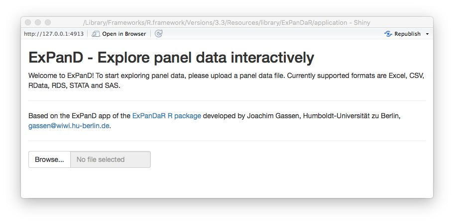
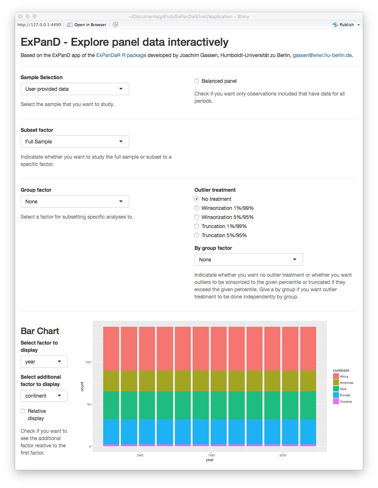
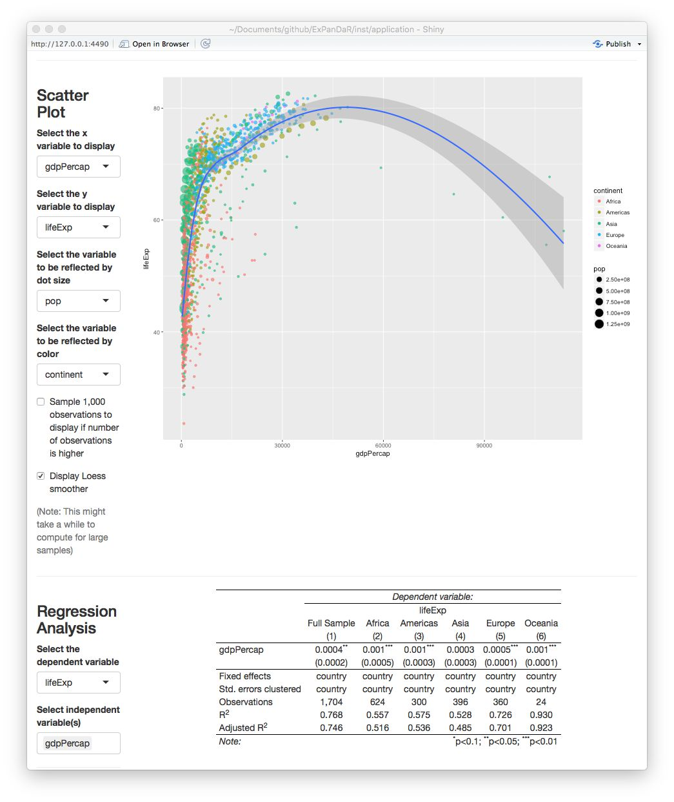
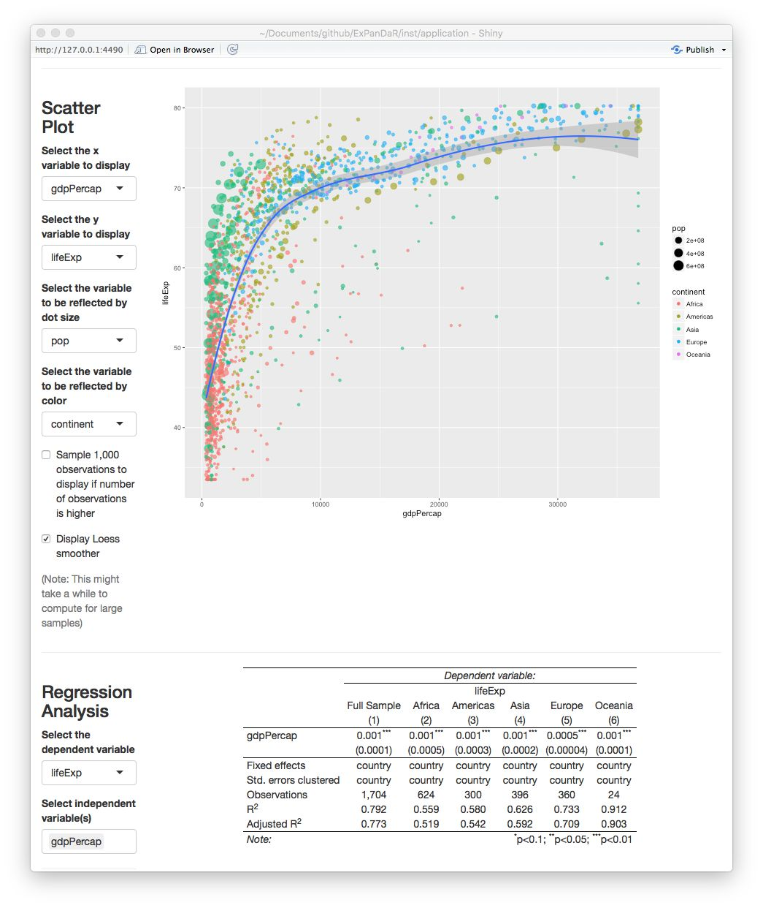
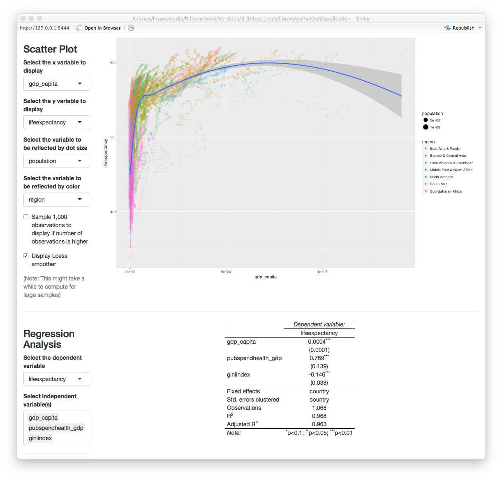
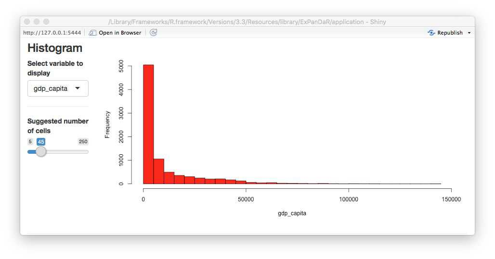
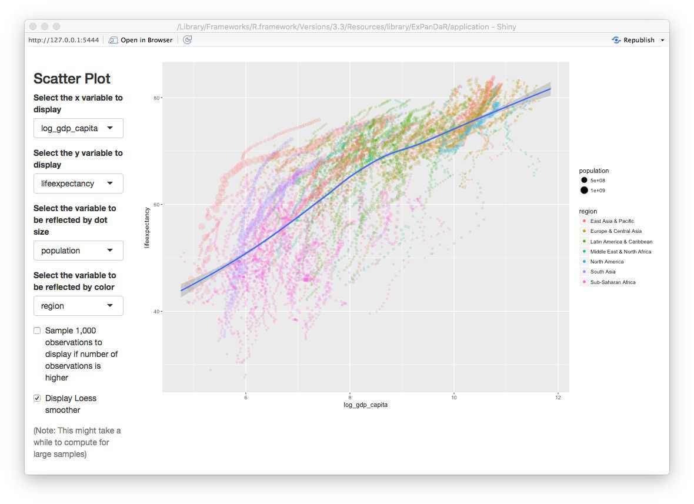
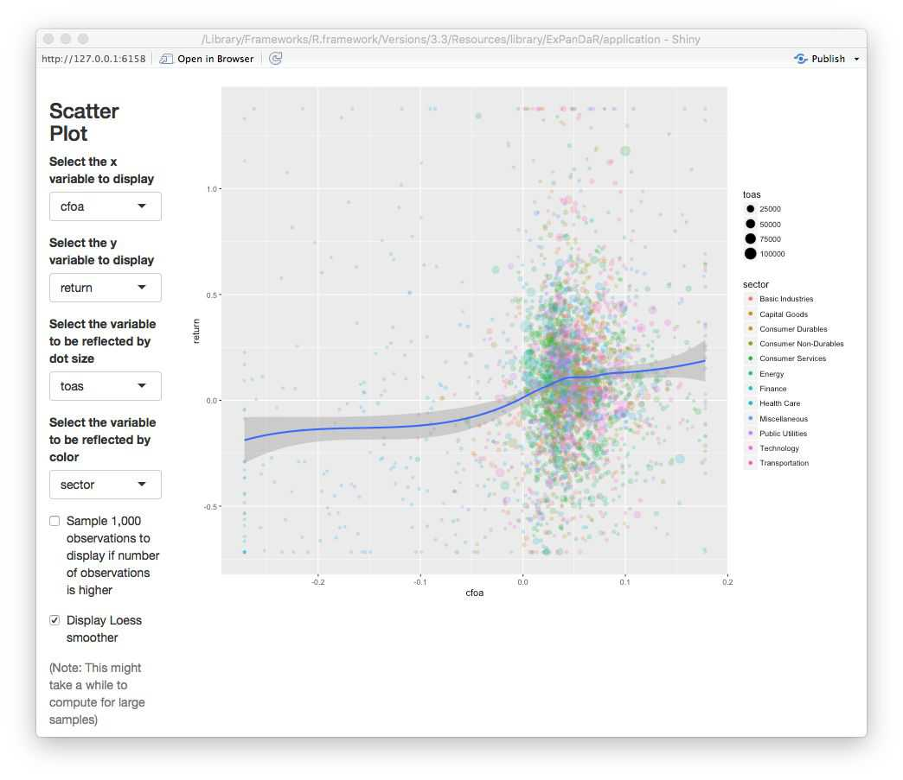
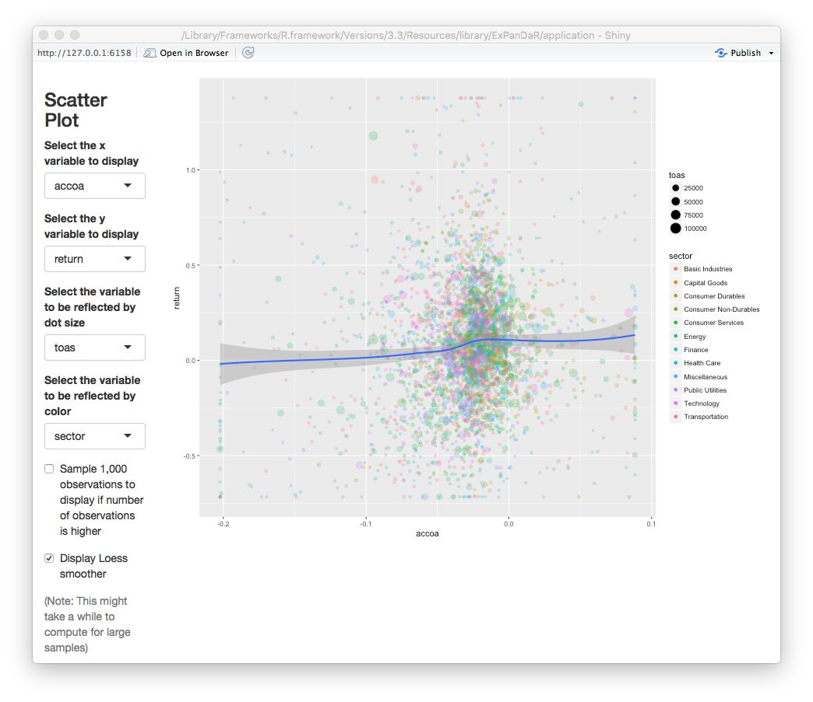
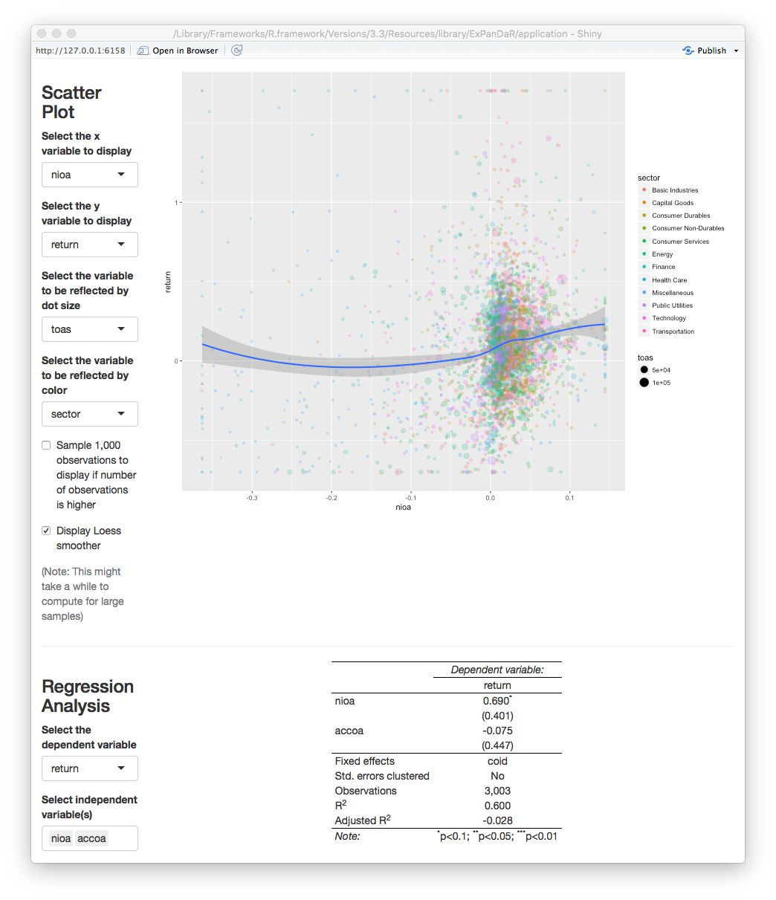

```{r setup, include = FALSE}
library(ExPanDaR)
library(gapminder)

knitr::opts_chunk$set(
  collapse = TRUE,
  comment = "#>"
)
```

ExPanD is a shiny based app building on the functions of the ExPanDaR package.
Its purpose is to make panel data exploration fun and easy. Using ExPanD you can

- quickly explore panel data, regardless of its origin,
- prototype simple test designs and verify them out-of sample and 
- provide users the opportunity to assess the robustness of your findings without providing them access to the underlying data.

This vignette will guide you through the process of using ExPanD by discussing three use cases. 
While the first two use macro-economic data to explore the association of gross domestic production 
(GDP) per capita with life expectancy at birth, the last use case explores the association between 
financial accounting performance measures and concurrent stock returns.

If you do not use R you can still use the ExPanD app to explore panel data! In this case,
access the hosted variant of the ExPanD app [here](https://jgassen.shinyapps.io/expand/) 
and follow the advice below on how to upload a suitable panel data file for online exploration. 
No worries: Your data won't be stored on the server and will be deleted from memory 
once the connection to the server is closed.

## Starting ExPanD to upload a local file containing panel data

The easiest way to start using ExPanD is to use it with a local data file containing panel data. 
ExPanD supports Stata, SAS, CSV, Excel and R file formats.

For using ExPanD from within R, you have to install the ExPanDaR package and start ExPanD.

``` {r expand_file, eval = FALSE}
devtools::install_github("joachim-gassen/ExPanDaR")
library(ExPanDaR)

ExPanD()
```

Alternatively, you can simply access the online hosted version of the ExPanD app 
[here](https://jgassen.shinyapps.io/expand/) (no R required).

After starting ExPanD, you will be greeted with a bare bones file upload dialog.

```{r, out.width = "90%", fig.align="center", fig.border = "none", echo=FALSE}

```

Now you need a file to explore. Feel free to use whatever you want but for our first use case 
I will use the well-known `gapminder` dataset provided by the gapminder package (click [here](https://www.gapminder.org) if you do not know the gapminder initiative).

``` {r gapminder}
library(gapminder)
head(gapminder, 10)
# write.csv(gapminder, file = "gapminder.csv", row.names = FALSE)
```

To use ExPanD, you need the following:

- A dataset in long format containing panel data (at least one factor and two numerical variables are required),
- a variable or a vector of variables within this dataset that identifies a cross-sectional observation and
- a variable that is coercible to an ordered factor and that identifies (and sorts) the time dimension of your panel.

As you see, the gapminder file contains country-year data. It is organized in a long format by using `country` as 
cross-sectional identifier and `year` as time-series identifier. Each of the additional variables is then stored 
in a separate column. It has one factor (`continent`)
and three numerical variables (`lifeExp`, `pop` and `gdpPercap`). So, it complies with the above requirements.

Use the commented-out `write.csv()` function call to save the CSV file to your system and the file dialog to load it into ExPanD 
(if you are not using R, you can download the CSV file 
[here](https://github.com/joachim-gassen/ExPanDaR/raw/master/vignettes/data/gapminder.csv)).
After uploading the file, two dialog boxes will appear asking you to select the cross-sectional identifier(s)
and the time-series identifier.

```{r, out.width = "90%", fig.align="center", fig.border = "none", echo=FALSE}
knitr::include_graphics("figures/ExPanD_file_02.jpg")
```

Select `country` as the cross-sectional identifier and `year` as the time-series identifier. ExPanD will now process
the data to display it so that you can start exploring.

## Starting ExPanD with a data frame containing panel data

Alternatively, if you are using R you can bypass the file upload dialog by specifying a data frame and its cross-sectional 
as well as time-series identifiers.

``` {r expand_simple, eval = FALSE}
devtools::install_github("joachim-gassen/ExPanDaR")
library(ExPanDaR)
library(gapminder)

ExPanD(df = gapminder, cs_id = "country", ts_id = "year")
```


## Exploring data 

Regardless whether you uploaded the gapminder data via the file dialog or specified the data frame in the `ExPanD()` function call, the ExPanD shiny app will start up and look like this.

```{r, out.width = "90%", fig.align="center", fig.border = "none", echo=FALSE}

```

As can be seen by the bar chart, the gapminder dataset provides a balanced panel of `r length(unique(gapminder$country))` countries with `r length(unique(gapminder$year))` observations per country. The missing values graph shows no missing data across all variables. When you scroll down, you will see that the dataset contains three numerical variables. Play around with the histogram and the extreme observation table to learn more about these. The time trend graph and the quantile time trend communicate good news: the life expectancy is increasing over time world-wide. You can verify that the same holds true for the population of the sample countries and for their GDP per capita. You will also notice that for the latter two the cross-country distribution widens over time.

The gapminder dataset is often used to document the strong positive association between GDP per capita and life expectancy. You can see this association in the correlation plot. The blue ellipsoid above (below) the diagonal visualizes the positive Pearson (Spearman) correlation of the two variables. If you are interested in the exact correlation values, hover over the ellipsoid with your mouse.

The scatter plot and the regression analysis section allow you to explore this association in a little bit more detail. Below you will see a screenshot where I prepared a "Hans Rosling" scatter plot (click [here](https://www.ted.com/talks/hans_rosling_shows_the_best_stats_you_ve_ever_seen) if you do not know the name). In addition, I estimated a by region OLS model with country fixed effects and standard errors clustered by country to verify that the association is not just driven by unobservable time-constant country heterogeneity.

```{r, out.width = "90%", fig.align="center", fig.border = "none", echo=FALSE}

```

Looking at the scatter plot you notice that there are some observations with extremely high GDP per capita that trigger the LOESS smoother line to get a negative slope. If you hover over the dots with your mouse you will see that these are observations from Kuwait. To what extent are our regression results affected by these extreme observations? To figure this out, scroll up and select to winsorize your data at the 1 % level. After doing this, the figure from above now looks like this.

```{r, out.width = "90%", fig.align="center", fig.border = "none", echo=FALSE}

```

The association has become more robust across regions and the scatter plot now shows a positive association across the complete range of winsorized GDP per capita.

Continue to play around with your data. Let us assume that at some point you find something that you consider worth preserving so that next time you start ExPanD with the gapminder dataset, it starts directly into the view that you just have. No problem! Just scroll down to the bottom of the page. There, you will find a save dialog (and a load dialog as well, just in case). Save your ExPanD choices to a place that you will remember. The file that will be stored is a plain list, saved as a RDS file. Assuming that you named the file "ExPanD_config.RDS" and stored in your current work directory, you can now start ExPanD right into your favorite analysis by providing this list.

``` {r simple_expland_config, eval = FALSE}
ExPanD_config <- readRDS("ExPanD_config.RDS")
ExPanD(df = gapminder, cs_id = "country", ts_id = "year", config_list = ExPanD_config)
```


## Defining additional variables

The gapminder dataset contains only three numerical variables. You might wonder how the association between GDP per capita and life expectancy would look like if you include additional test or control variables. In addition, GDP per capita, as a metric affected by growth processes, is far from being normally distributed. Does the association with life expectancy hold when you log transform it? Time for our second use case that re-examines the above presented association by using data provided by the World Bank.

The questions of the last paragraph are typical for exploratory data analysis workflows and ExPanD is equipped to handle them. When started in its "advanced mode", it provides two samples: A base sample and an analysis sample. You can then define additional variables based on the base sample interactively. 

When you call ExPanD without options, it will start into the advanced mode, generating an analysis sample that is identical to the sample that you uploaded. When you start ExPanD by providing it with a data frame at the command line, you decide whether you want to use the "simple" or "advanced" mode. When you prepare a data frame containing variable definitions via the `var_def` parameter, ExPanD will start in the advanced mode.

A variable definition file has to contain at least three character columns: `var_name`, `var_def` and `type`. In addition, it can contain a logical column `can_be_na`. Let's take a look at the variable definition data frame for the `worldbank` dataset provided by the ExPanDaR package.

``` {r var_def}
head(worldbank_var_def, 10)
```

`var_name` contains variable names for the analysis sample and `var_def` contains the definitions for these variables.
The definitions refer to variables contained in the `worldbank` dataset (which are conforming to the naming convention of the World Bank).
Most definitions are just simple 1:1 transformations of the `worldbank` dataset but, as you can see from the definition for `time`, you can also use standard R expressions within the scope of the `worldbank` data frame. For the R experts: Your definition will be evaluated within a `dplyr::mutate()` call on the base data frame grouped by the cross section and ordered by the time-series identifier, so for example that `lead()` and `lag()` should work as expected.

With the `type` variable you specify the nature of the variable that you just defined. Possible values are `cs_id`, `ts_id`, `numeric`, `logical`, and `factor`. They identify cross-sectional identifier(s), the time-series identifier, numerical variables, Boolean (True/False) type variables, and variables to be treated as grouping factors. Note that the data does not have to have the according class but is has to be coercible to it.

The `can_be_na` variable can be omitted. If you do not provide it, it will be set to `TRUE` for all variables besides the cross-sectional and time-series identifiers. In the `worldbank_var_def` data frame it is set to `FALSE` for the variables `time`, `gdp`, `population`, and `gpd_capita`, meaning that only observations with non-missing values for these variables will be included in the analysis dataset.

By customizing this data frame that you provide to `ExPanD()` via the `var_def` parameter, you can design the analysis sample as you wish. An alternative and more interactive approach is to define variables interactively while running `ExPanD()`. Let's try. Run the following code to start ExPanD with the `worldbank` base data in advanced mode.

``` {r worldbank, eval = FALSE}
library(ExPanDaR)

ExPanD(df = worldbank, 
       df_def = worldbank_data_def,
       var_def = worldbank_var_def,
       config_list = ExPanD_config_worldbank)
```

What you will see is a similar analysis to the gapminder analysis of the first use case but with a more extensive dataset. The scatter plot and the regression analysis are displayed below.

```{r, out.width = "90%", fig.align="center", fig.border = "none", echo=FALSE}

```

It shows a positive association of GDP per capita with life expectancy after controlling for public spending on health and income inequality (which happens to be negatively associated with life expectancy). As you see from the table, the number of observations is 1,068. How does this reconcile with the roughly 8,500 observations that the World Bank sample has data for? A quick look at the missing values graph below helps to understand the issue.

```{r, out.width = "90%", fig.align="center", fig.border = "none", echo=FALSE}
knitr::include_graphics("figures/ExPanD_worldbank_02.jpg")
```

While `gdp_capita` is available for all observations (remember the `can_be_na` variable in the data definition data frame?) and `life_expectancy` has good coverage for all but the most recent years, both `pubspend_health_gdp` and `giniindex` are only available for later years in the sample. `giniindex` is also only available for a subset of countries. Taken together, this drastically reduces the sample size of the regression model. Explore whether this has an effect on the documented associations by excluding and including the test variables one-by-one. You will see that the associations are reasonable robust.

Now let's see whether the distributional properties of the main independent variable of interest have an impact on the association. The screenshot below displays the histogram of `gdp_capita`.

```{r, out.width = "90%", fig.align="center", fig.border = "none", echo=FALSE}

```

This looks like a log-normal distributed variable, so a log transformation should yield a more normally distributed variable. To calculate a logged variant of `gdp_capita` we first need to find which World Bank data item `gdp_capita` is based on. Hovering with your mouse over the variable name in the descriptive sample, you will see that it is based on the data item `NY.GDP.PCP.KD`. When you switch the tab of the descriptive statistics to the base sample, you can see all 72 base data items that the `worldbank` dataset contains. Use the dialog above the descriptive statistics as shown below to calculate a log-transformed measure of GDP per capita.

```{r, out.width = "90%", fig.align="center", fig.border = "none", echo=FALSE}
knitr::include_graphics("figures/ExPanD_worldbank_04.jpg")
```

You will see a message window that your variable was successfully generated. How does its histogram look like?

```{r, out.width = "90%", fig.align="center", fig.border = "none", echo=FALSE}
knitr::include_graphics("figures/ExPanD_worldbank_05.jpg")
```

Better. Now let's see how this new variable is associated with life expectancy. First a quick look at the scatter plot.

```{r, out.width = "90%", fig.align="center", fig.border = "none", echo=FALSE}

```

Now this looks different than the gapminder plot in the section above as it exhibits a more linear association. Let's see how our regression model looks like when use `log_gdp_capita` instead of `gdp_capita`.

```{r, out.width = "90%", fig.align="center", fig.border = "none", echo=FALSE}
knitr::include_graphics("figures/ExPanD_worldbank_07.jpg")
```

The logged version of GDP per capita remains robustly positively associated with life expectancy but now income inequality (as measured by `giniindex`) is only marginally associated with life expectancy.

Another thing that one can notice from the scatter plot above is that each country appears to be on its own "trajectory" in terms of life expectancy development. As we also know that in most countries and periods GDP per capita increases over time: Can we be sure that the association of GDP per capita and life expectancy is different from a general time trend in the data? Below, you will find a scatter plot that uses `time` as the independent variable.

```{r, out.width = "90%", fig.align="center", fig.border = "none", echo=FALSE}
knitr::include_graphics("figures/ExPanD_worldbank_08.jpg")
```

You can see that for most countries, life expectancy seems to follow a robust and similar linear time trend. There are some exceptions from this rule (China, Mali, Rwanda, Sierra Leone). To infer whether our association "survives" a control for time-induced variance in life expectancy that is stable across countries, we estimate a regression model that includes country and year fixed effects. See below.

```{r, out.width = "90%", fig.align="center", fig.border = "none", echo=FALSE}
knitr::include_graphics("figures/ExPanD_worldbank_09.jpg")
```

All associations are gone. Fun fact: When you replace `lag_gdp_capita` with `gdp_capita` you will see that it's coefficient even turns significantly negative meaning that increasing GDP per capita is associated with a decrease in life expectancy!

Please keep in mind that the above is not meant to challenge common believes in health economics and epidemiology but is merely being presented as a use case for interactive data exploration to infer the robustness of statistical inference.

## Using ExPanD with multiple samples

There are instances where you might want to explore several samples simultaneously. Two examples:

- You are analyzing observational data and data is available from alternative data sources. You are interested to learn whether data from different data sources will generate the same insights.
- You want to use exploratory data analysis to develop a predictive model. You need to test this predictive model out of sample. For this, you split your original sample in a training and a test dataset.

Our third and final use case will build on the second motivation. For this, we will explore and test an association that is a key finding in an area where I do most of my research work: financial accounting and capital markets.

I do not want to bore you with the details but in essence the topic that we will explore is the concurrent association between financial reporting measures of corporate performance and stock market returns. Prior research has documented that financial reporting performance measures, most prominently net income, have a robust but overall weak association with concurrent stock market returns. Net income can be broken up in two components: Cash flow from operations and total accruals. While the former essentially captures the net cash receipts that a company realizes over the year as an outcome of its operating business activities, the latter reflects the financial accounting adjustments to reflect timing disparities between economic activities and cash collection. Two examples for total accruals:

- A company sells goods to a customer in period 1 but does not collect the cash revenue until period 2. This results in a positive accrual in period 1 and a negative accrual in period 2.
- A company buys and pays inventory in period 1, uses it in production in period 2, and sells the goods for cash in period 3. Here, we would have a positive accrual (adjusting the negative cash flow from operations) in period 1 and a negative accrual in period 3.

Generously glossing other many important details, the accounting literature has documented three key findings around this notion:

- Both, cash flows from operations and total accruals, are associated with concurrent stock returns
- Cash flows from operations have a stronger association with returns than total accruals
- The stock market seems to miss-price accruals meaning that it puts too much weight on accruals when incorporating net income news in stock prices.

We will revisit the second statement. To do so, we use the dataset `russell_3000` that is 
included with the ExPanDaR package. Most capital market based research uses data from commercial data vendors, requiring researchers to obtain a costly license. To circumvent this barrier to open science, we collect data from publicly available APIs (Yahoo and Google Finance) using the `tidyquant` package. The sample comprises available data for a sample of U.S. listed firms that where members of the Russell 3000 index in 2017. The data are more or less as provided by `tidyquant` and are used here for illustrative purposes only.

To explore the data and to test a model on the data, we split the `russell_3000` in two equally sized randomly selected samples: The "training sample" and the "test sample". The idea is that we will explore the training sample but will infer the significance of our association test from the test sample. Run the following to generate the two samples and to start ExPanD with them.
 
``` {r expand_two_samples, eval = FALSE}
library(ExPanDaR)
set.seed(42)
training_sample <- sample(nrow(russell_3000), round(.5*nrow(russell_3000)))
test_sample <- setdiff(1:nrow(russell_3000), training_sample)

ExPanD(df = list(russell_3000[training_sample, ], russell_3000[test_sample, ]),
       df_def = russell_3000_data_def,
       df_name = c("Training sample", "Test sample"))
```

ExPanD starts displaying the training sample. As you can infer from the bar chart and the descriptive table, the `russell_3000` dataset contains a short unbalanced panel of four years and `r format(length(unique(russell_3000$coid)), big.mark = ",")` firms. Also, you have varying amounts of missing data across the variables of the dataset with some variables containing no values for the first fiscal year of the sample. When you hover with your mouse over the variable names in the descriptive table a tool-tip will present you with hopefully informative variable definitions.

Where do the variable definitions come from? When you take a look at the `ExPanD()` function call, you will notice the `df_def` parameter. It points to a data frame provided by the ExPanDaR package that provides the variable definitions.

The variables that we are interested in are `return` (the annual stock market return and our dependent variable), `nioa` (net income, deflated by average total assets), `cfoa` (cash flow from operations, deflated by average total assets) and `accoa` (total accruals, deflated by average total assets). To explore their level of association, I suggest that you start with analyzing the scatter plot of cash flow and returns. You will notice that, again, extreme observations are relatively influential. Limit their influence by winsorizing to the 1 % and 99 % percentile. After doing that, you will get an image that looks like the screenshot below.
 
```{r, out.width = "90%", fig.align="center", fig.border = "none", echo=FALSE}

```

There seems to be the predicted positive association, although it is relatively weak and mostly confined to positive cash flows. Let's see how the association looks like for accruals in the picture below.

```{r, out.width = "90%", fig.align="center", fig.border = "none", echo=FALSE}

```

No robust association visible here. To test whether the two associations indeed differ, we set up a regression model using the fact that $nioa = cfoa + accoa$. This is why we can test for significant differences in the association by regressing returns on net income and accruals. If the coefficient for accruals turns out to be significantly negative, we found evidence that the association of accruals with returns is significantly weaker that the association of cash flow with returns. In order to control for unobserved time-constant factors that drive stock market returns and that vary at the firm level, we include firm fixed effects in the analysis. The figure below shows our findings for the training sample. 

```{r, out.width = "90%", fig.align="center", fig.border = "none", echo=FALSE}
knitr::include_graphics("figures/ExPanD_two_samples_03.jpg")
```

We find a marginally significant coefficient for $accoa$ but, as we discussed above, we should not base our inferences on the training sample since we used this sample to explore the data. For example, our (admittedly ad hoc) decision to winsorize the data was based on a visual inspection of the scatter plot. In a strict sense, this violates the usage of this data for testing. So, scroll up, switch the sample to the test sample and see what you find.

```{r, out.width = "90%", fig.align="center", fig.border = "none", echo=FALSE}

```

As the screenshot shows, we find no significant coefficient for $accoa$. This indicates that the predicted difference in associations is not statistically significant at conventional levels. While this might be driven by the relatively low power of the test (short panel with cross-sectional fixed effects), I encourage you to use ExPanD to explore this finding further. You will easily notice that depending on how exactly you specify your test (fixed effect structures, standard error clustering, etc.) and whether/how you cut your training and test sample, you are able to generate findings that are or are not "statistically significant at conventional levels". So, again, this use case of ExPanD demonstrates how the app can be used to assess the robustness of statistical inference.

## Making ExPanD available to users without providing them raw data access 

In many instances, you as a researcher want to provide readers, editors and/or reviewers the opportunity to assess the robustness of your findings but are unable to provide them with the underlying data as this data is subject to commercial licensing or other usage restrictions. By uploading your ExPanD instance on a public server, you can make your results accessible without sharing the data. As shiny apps can be hosted on dedicated servers, this is easily achieved. Maybe you noticed the "Publish" icon in the top-right corner of your ExPanD window. Click on it to learn more about your options.

As an example, you can access an ExPanD-based extension of a current working paper of our team [here](https://jgassen.shinyapps.io/expacc/).
