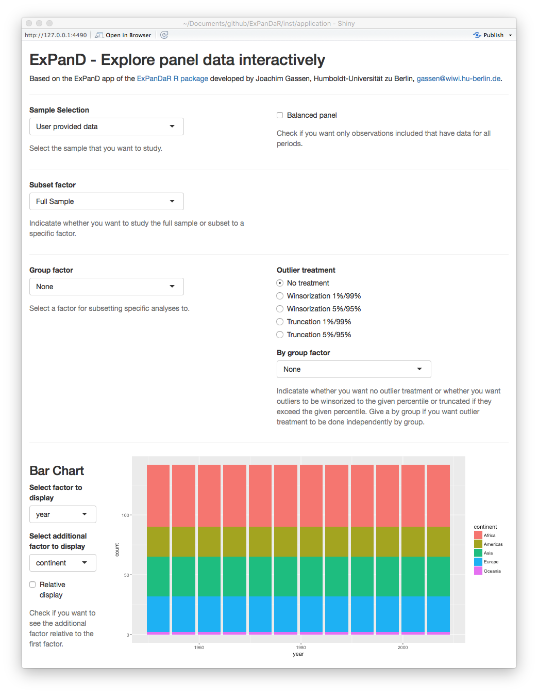

```{r setup, include = FALSE}
knitr::opts_chunk$set(
  collapse = TRUE,
  comment = "#>"
)
```

The `ExPanDaR` package provides a set of functions for exploratory data analysis 
of panel data. It uses a shiny-based front end (the "ExPanD" app) to showcase its 
exploration tools and standardized data structure interfaces that make it easy 
to use ExPanD on various datasets.

This Vignette will guide you through the process of using ExPanD. It starts with a simple use case. Later versions of this vignette will in addition present more advanced features of the ExPanD app.

## Using ExPanD to explore an existing data frame containing panel data

To use ExPanD you need the following:

- A data frame containing panel data,
- a variable or a vector of variables within this data frame that identifies a cross-sectional observation and
- a variable that is coercible to an ordered factor and that identifies (and sorts) the time dimension of your panel.

Let's get started using the well-known `gapminder` dataset provided by the gapminder package (click [here](https://www.gapminder.org) if you do not know the gapminder imitative).

``` {r gapminder}
library(gapminder)

head(gapminder, 10)
```

The gapminder dataset contains country-year observations. It uses `country` as 
cross-sectional identifier and `year` as time-series identifier. You can use ExPanD 
on it by simply specifying these identifiers.

``` {r simple_expland, eval = FALSE}
library(ExPanDaR)

ExPanD(df = gapminder, cs_id = "country", ts_id = "year")
```

The ExPanD shiny app will start up, looking something like this.

```{r, out.width = "90%", fig.align="center", fig.border = "none", echo=FALSE}

```

As can be seen by the bar chart, the gapminder dataset provides a balanced panel of `r length(unique(gapminder$country))` observations. When you scroll down, you will see
that it contains three numerical variables. Play around with the histogram and the extreme observation table to learn more about these. The time trend graph and the quantile time trend communicate good news: the life expectancy is increasing over time world-wide. You can verify that the same holds true for the population of the sample countries and for their GDP per capita. You will also notice that for the latter two the cross-country distribution widens over time.

The gapminder dataset is often used to document the strong positive association between GDP per capita and life expectancy. You can see this association in the correlation plot. The blue ellipsoid above (below) the diagonal visualizes the positive Pearson (Spearman) correlation of the two variables. If you are interested in the exact correlation values, hover over the ellipsoid with your mouse.

The scatter plot and the regression analysis section allow you to explore this association in a little bit more detail. Below you will see a screenshot where I prepared a "Hans Rosling" scatter plot (click [here](https://www.ted.com/talks/hans_rosling_shows_the_best_stats_you_ve_ever_seen) if you do not know the name). In addition, I estimated a by region OLS model with country fixed effects and standard errors clustered by country to verify that the association is not just driven by unobservable time-constant country heterogeneity.

```{r, out.width = "90%", fig.align="center", fig.border = "none", echo=FALSE}
knitr::include_graphics("figures/ExPanD_simple_02.png")
```

Looking at the scatter plot you notice that there are some observations with extremely high GDP per capita that trigger the LOESS smoother line to get a negative slope. If you hover over the dots with your mouse you will see that these are observations from Kuwait. To what extent are our regression results affected by these extreme observations? To figure this out, scroll up and select to winsorize your data at the 1 % level. After doing this, the figure from above now looks like this.

```{r, out.width = "90%", fig.align="center", fig.border = "none", echo=FALSE}
knitr::include_graphics("figures/ExPanD_simple_03.png")
```

The association has become more robust across regions and the scatter plot now shows a positive association across the complete range of winsorized GDP per capita.

Continue to play around with your data. Let us assume that at some point you find something that you consider worth preserving so that next time you start ExPanD with the gapminder dataset, it starts directly into the view that you just have. No problem! Just scroll down to the bottom of the page. There, you will find a save dialog (and a load dialog as well, just in case). Save your ExPanD choices to a place that you will remember. The file that will be stored is a plain list, saved as a RDS file. Assuming that you named the file "ExPanD_config.RDS" and stored in your current work directory, you can now start ExPanD right into your favorite analysis by providing this list.

``` {r simple_expland_config, eval = FALSE}
ExPanD_config <- readRDS("ExPanD_config.RDS")
ExPanD(df = gapminder, cs_id = "country", ts_id = "year", config_list = ExPanD_config)
```

Besides acting as tool for interactive exploratory data analysis, one key objective of ExPanD is to enable readers to quickly assess the robustness of statistical inference in academic studies. For that to work, the app needs to be publicly available. As shiny apps can be hosted on dedicated servers, this is easily to achieve. Maybe you noticed the "Publish" icon in the top-right corner of your ExPanD window. Click on it to learn more about your options. As an example, you can access an ExPanD-based extension of a current working paper of our team 
[here](https://jgassen.shinyapps.io/expacc/).
