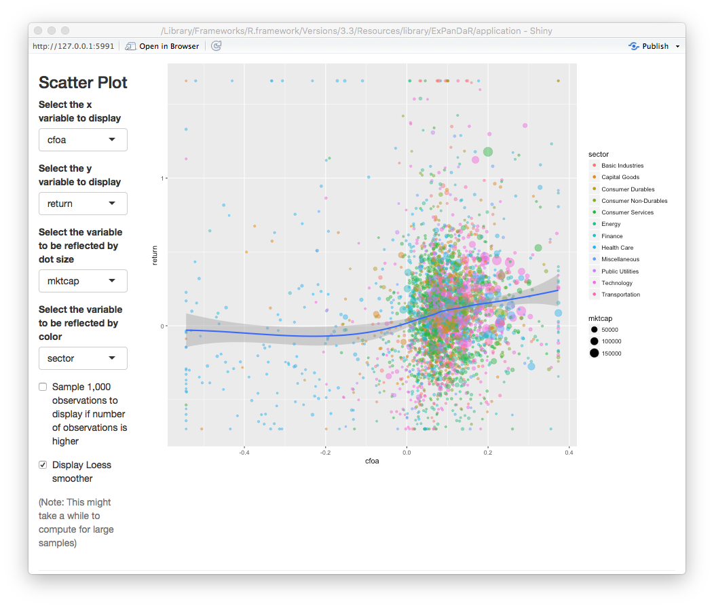
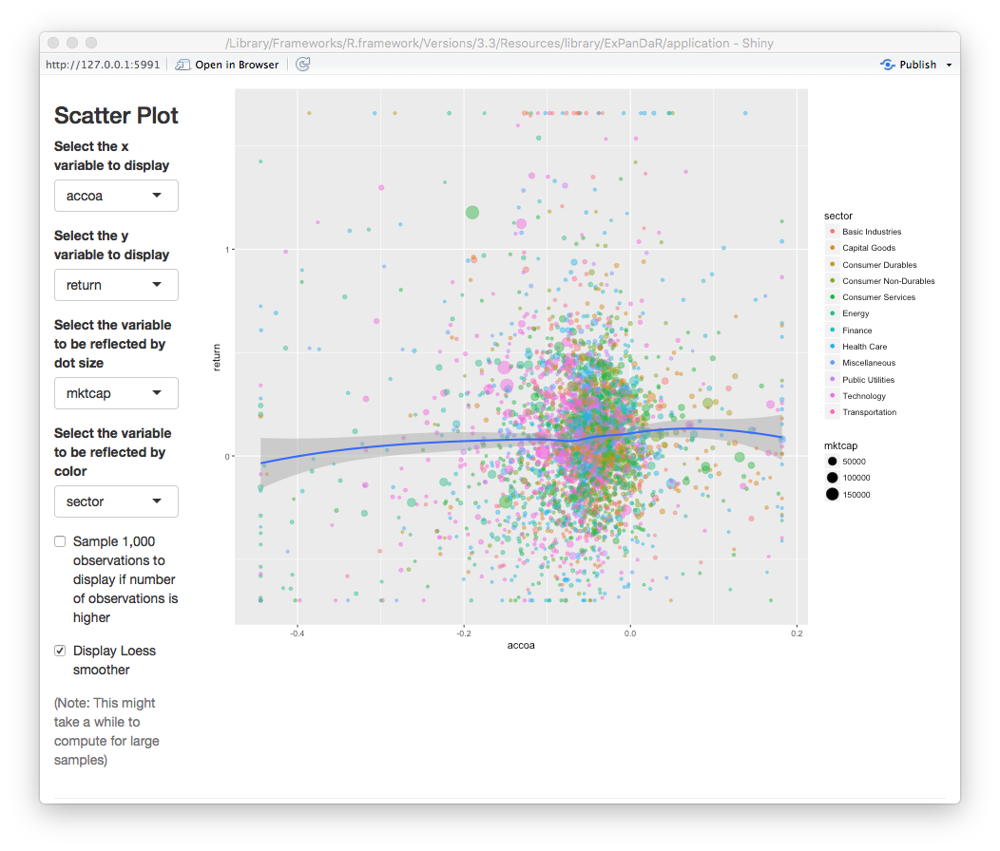
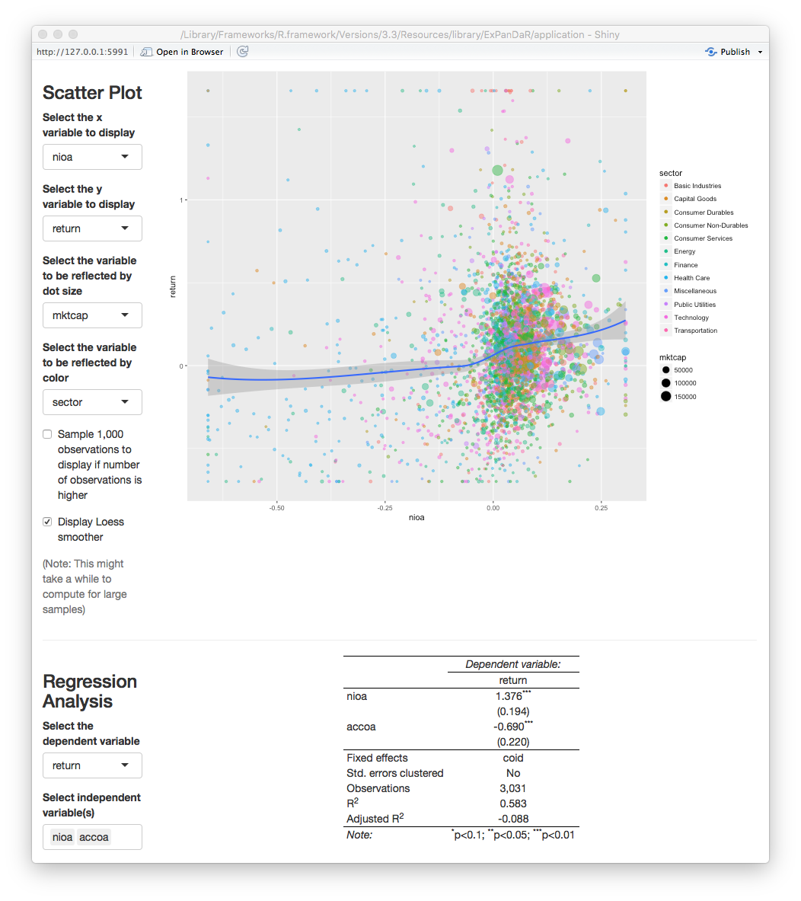
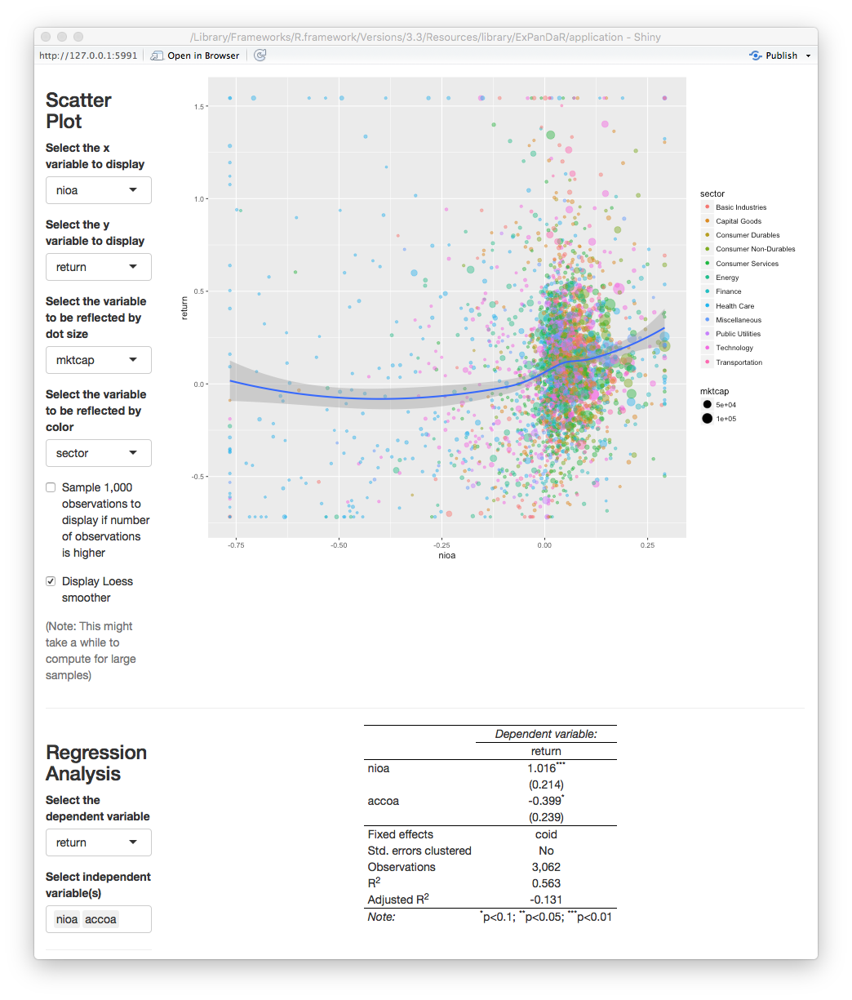

```{r setup, include = FALSE}
library(ExPanDaR)
library(gapminder)

knitr::opts_chunk$set(
  collapse = TRUE,
  comment = "#>"
)
```

The `ExPanDaR` package provides a set of functions for exploratory data analysis 
of panel data. It uses a shiny-based front end (the "ExPanD" app) to showcase its 
exploration tools and standardized data structure interfaces that make it easy 
to use ExPanD on various datasets.

This Vignette will guide you through the process of using ExPanD. It starts with two relatively simple use cases. Later versions of this vignette will in addition present a more advanced feature of the ExPanD app.

## Using ExPanD to explore an existing data frame containing panel data

To use ExPanD you need the following:

- A data frame containing panel data,
- a variable or a vector of variables within this data frame that identifies a cross-sectional observation and
- a variable that is coercible to an ordered factor and that identifies (and sorts) the time dimension of your panel.

Let's get started using the well-known `gapminder` dataset provided by the gapminder package (click [here](https://www.gapminder.org) if you do not know the gapminder imitative).

``` {r gapminder}
library(gapminder)

head(gapminder, 10)
```

The gapminder dataset contains country-year observations. It uses `country` as 
cross-sectional identifier and `year` as time-series identifier. You can use ExPanD 
on it by simply specifying these identifiers.

``` {r expand_simple, eval = FALSE}
library(ExPanDaR)

ExPanD(df = gapminder, cs_id = "country", ts_id = "year")
```

The ExPanD shiny app will start up, looking something like this.

```{r, out.width = "90%", fig.align="center", fig.border = "none", echo=FALSE}
knitr::include_graphics("figures/ExPanD_simple_01.png")
```

As can be seen by the bar chart, the gapminder dataset provides a balanced panel of `r length(unique(gapminder$country))` countries with `r length(unique(gapminder$year))` observations per country. When you scroll down, you will see that it contains three numerical variables. Play around with the histogram and the extreme observation table to learn more about these. The time trend graph and the quantile time trend communicate good news: the life expectancy is increasing over time world-wide. You can verify that the same holds true for the population of the sample countries and for their GDP per capita. You will also notice that for the latter two the cross-country distribution widens over time.

The gapminder dataset is often used to document the strong positive association between GDP per capita and life expectancy. You can see this association in the correlation plot. The blue ellipsoid above (below) the diagonal visualizes the positive Pearson (Spearman) correlation of the two variables. If you are interested in the exact correlation values, hover over the ellipsoid with your mouse.

The scatter plot and the regression analysis section allow you to explore this association in a little bit more detail. Below you will see a screenshot where I prepared a "Hans Rosling" scatter plot (click [here](https://www.ted.com/talks/hans_rosling_shows_the_best_stats_you_ve_ever_seen) if you do not know the name). In addition, I estimated a by region OLS model with country fixed effects and standard errors clustered by country to verify that the association is not just driven by unobservable time-constant country heterogeneity.

```{r, out.width = "90%", fig.align="center", fig.border = "none", echo=FALSE}
knitr::include_graphics("figures/ExPanD_simple_02.png")
```

Looking at the scatter plot you notice that there are some observations with extremely high GDP per capita that trigger the LOESS smoother line to get a negative slope. If you hover over the dots with your mouse you will see that these are observations from Kuwait. To what extent are our regression results affected by these extreme observations? To figure this out, scroll up and select to winsorize your data at the 1 % level. After doing this, the figure from above now looks like this.

```{r, out.width = "90%", fig.align="center", fig.border = "none", echo=FALSE}
knitr::include_graphics("figures/ExPanD_simple_03.png")
```

The association has become more robust across regions and the scatter plot now shows a positive association across the complete range of winsorized GDP per capita.

Continue to play around with your data. Let us assume that at some point you find something that you consider worth preserving so that next time you start ExPanD with the gapminder dataset, it starts directly into the view that you just have. No problem! Just scroll down to the bottom of the page. There, you will find a save dialog (and a load dialog as well, just in case). Save your ExPanD choices to a place that you will remember. The file that will be stored is a plain list, saved as a RDS file. Assuming that you named the file "ExPanD_config.RDS" and stored in your current work directory, you can now start ExPanD right into your favorite analysis by providing this list.

``` {r simple_expland_config, eval = FALSE}
ExPanD_config <- readRDS("ExPanD_config.RDS")
ExPanD(df = gapminder, cs_id = "country", ts_id = "year", config_list = ExPanD_config)
```

Besides acting as a tool for interactive exploratory data analysis, one key objective of ExPanD is to enable readers to quickly assess the robustness of statistical inference in academic studies. For that to work, the app needs to be publicly available. As shiny apps can be hosted on dedicated servers, this is easily to achieve. Maybe you noticed the "Publish" icon in the top-right corner of your ExPanD window. Click on it to learn more about your options. As an example, you can access an ExPanD-based extension of a current working paper of our team [here](https://jgassen.shinyapps.io/expacc/).

## Using ExPanD with multiple samples

There are instances where you might want to explore several samples simultaneously. Two examples:

- You are analyzing observational data and data is available from alternative data sources. You are interested to learn whether data from different data sources will generate the same insights.
- You want to use exploratory data analysis to develop a predictive model. You need to test this predictive model out of sample. For this, you split your original sample in a training and a test dataset.

Our next use case will build on the second motivation. For this, we will explore and test an association that is a key finding in an area where I do most of my research work: financial accounting and capital markets.

I do not want to confuse you with the details but in essence the topic that we will explore is the concurrent association between financial reporting measures of corporate performance and stock market returns. Prior research has documented that financial reporting performance measures, most prominently net income, have a robust but overall weak association with concurrent stock market returns. Net income can be broken up in two components: Cash flow from operations and Total accruals. While the former essentially captures the net cash receipts that a company realizes over the year as an outcome of its operating business activities, the latter reflects the financial accounting adjustments to reflect timing disparities between economic activities and cash collection. Two examples for total accruals:

- A company sells goods to a customer in period 1 but does not collect the cash revenue until period 2. This results in a positive accrual in period 1 and a negative accrual in period 2.
- A company buys and pays inventory in period 1, uses it in production in period 2, and sells the goods for cash in period 3. Here, we would have a positive accrual (setting of a negative cash flow from operations) in period 1 and a negative accrual in period 3.

Generously glossing other many important details, the accounting literature has documented three key findings around this notion:

- Both, cash flows from operations and total accruals, are associated with concurrent stock returns
- Cash flows from operations have a stronger association with returns than total accruals
- The stock market seems to miss-price accruals meaning that it puts to much weight on accruals when incorporating net income news in stock prices.

We will revisit the second statement. To do so, we use the dataset `russell_3000` that is 
included with the `ExPanDaR` package. Most capital market based research uses data from commercial data vendors, requiring researchers to obtain a costly license. To circumvent this barrier to open science, we collect data from publicly available APIs (Yahoo and Google Finance) using the `tidyquant` package. The sample comprises available data for a sample of U.S. listed firms that where members of the Russell 3000 index in 2017. The data are more or less as provided by `tidyquant` and are used here for illustrative purposes only.

To explore the data and to test a model on the data, we split the `russell_3000` in two equally sized randomly selected samples: The "training sample" and the "test sample". The idea is that we will explore the training sample but will infer the significance of our association test from the test sample. Run the following to generate the two samples and to start ExPanD with them.
 
``` {r expand_two_samples, eval = FALSE}
library(ExPanDaR)
set.seed(42)
training_sample <- sample(nrow(russell_3000), round(.5*nrow(russell_3000)))
test_sample <- setdiff(1:nrow(russell_3000), training_sample)

ExPanD(df = list(russell_3000[training_sample, ], russell_3000[test_sample, ]),
       cs_id = list(c("coid", "coname"), c("coid", "coname")), 
       ts_id = c("period", "period"),
       df_name = c("Training sample", "Test sample"))
```

ExPanD starts displaying the training sample. As you can infer from the bar chart and the descriptive table, the `russell_3000` dataset contains a short unbalanced panel of four years and `r format(length(unique(russell_3000$coid)), big.mark = ",")` firms. When you hover with your mouse over the variable names in the descriptive table a tool-tip will present you with hopefully informative variable definitions.

Where do the variable definitions come from? When you take a look at the `russell_3000` dataset, you will see that this dataset contains labels for its variables, generated by the `Hmisc::label()` statement. Whenever ExPanD is provided with a data frame containing labels it will uses them to generate the variable definitions that you just saw. An alternative way to provide variable definitions to ExPanD will be introduced in the next section.

The variables that we are interested in are `return` (the annual stock market return and our dependent variable), `nioa` (net income, deflated by average total assets), `cfoa` (cash flow from operations, deflated by average total assets) and `accoa` (total accruals, deflated by average total assets). To explore their level of association, I suggest that you start with analyzing the scatter plot of cash flow and returns. As soon as you started to do so, you will notice that, again, extreme observations are relatively influential. Limit their influence by winsorizing to the 1 % and 99 % percentile. After doing that, you will get an image that looks like the screenshot below.
 
```{r, out.width = "90%", fig.align="center", fig.border = "none", echo=FALSE}

```

There seems to be the predicted positive association, although it is relatively weak and mostly confined to positive cash flows. Let's see how the association looks like for accruals in the picture below.

```{r, out.width = "90%", fig.align="center", fig.border = "none", echo=FALSE}

```

No robust association visible here. To test whether the two associations indeed differ, we set up a regression model using the fact that $nioa = cfoa + accoa$. This is why we can test for significant differences in the association by regressing returns on net income and accruals. If the coefficient for accruals turns out to be significantly negative, we found evidence that the association of accruals with returns is significantly weaker that the association of cash flow with accruals. In order to control for unobserved time-constant factors that drive stock market returns and that vary at the firm level, we include firm fixed effects in the analysis. The figure below shows our findings for the training sample. 

```{r, out.width = "90%", fig.align="center", fig.border = "none", echo=FALSE}

```

As we discussed above, we should not base our inferences on the training sample as we used this sample to explore the data. For example, our (admittedly ad hoc) decision to winsorize the data was based on a visual inspection of the scatter plot. In a strict sense, this violates the usage of this data for testing. So, scroll up, switch the sample to the test sample and see what you find.

```{r, out.width = "90%", fig.align="center", fig.border = "none", echo=FALSE}

```

As the screenshot shows, we find only a marginally significant coefficient for $accoa$. This indicates that the predicted difference in associations is not statistically significant at conventional levels. While this might be driven by the power of the test (short panel with cross-sectional fixed effects), I encourage you to use ExPanD to explore this finding further. You will easily notice that depending on how exactly you specify your test (fixed effect structures, standard error clustering, etc.) and whether/how you cut your training and test sample, you are able to generate findings that are or are not "statistically significant at conventional levels". So, this use case of ExPanD demonstrates how the app can be used to assess the robustness of statistical inference.
